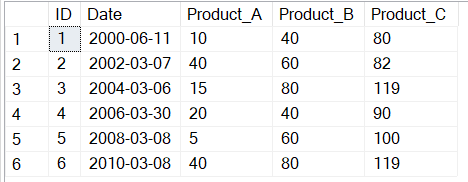
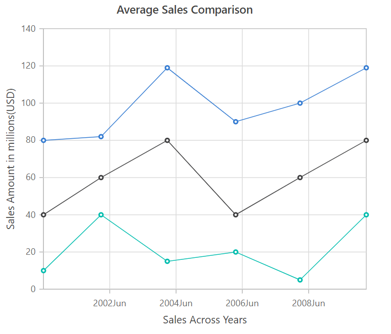

# Formatting chart data from database

* Create the chart data table using database. You can find the database table below,



You can assign data from the data base to the chart. The **series.dataSource** property should be provided with the data from the server, it accepts **JavaScript array of objects**.

```bash
  [
    { ID: 1, Date: "2000-06-11", Product_A: 10, Product_B: 40, Product_C: 80 },
    { ID: 2, Date: "2002-03-07", Product_A: 40, Product_B: 60, Product_C: 82 },
    { ID: 3, Date: "2004-03-06", Product_A: 15, Product_B: 80, Product_C: 119 },
    { ID: 4, Date: "2006-03-30", Product_A: 20, Product_B: 40, Product_C: 90 },
    { ID: 5, Date: "2008-03-08", Product_A: 5, Product_B: 60, Product_C: 100 },
    { ID: 6, Date: "2010-03-08", Product_A: 40, Product_B: 80, Product_C: 119 }
  ]

```

* Using the Angular CLI, we have used to service to get data from database

```bash
ng generate service chart
```

The command generates  ChartService class in src/app/chart.service.ts as follows:

```typescript
import { Injectable } from '@angular/core';

@Injectable({
  providedIn: 'root',
})
export class ChartService {

  constructor() { }

}

```

* Create a function call inside ngOnInit() to fetch the chart data from the service in app.componnet.ts file.

```typescript

ngOnInit(): void {
  this.getData();
}
 getData(): void {
    this.chartService.get().subscribe(data => {
      this.data = data;
    });
```

```typescript
import { BrowserModule } from '@angular/platform-browser';
import { NgModule } from '@angular/core';
// import the ChartModule for the Chart component
import { ChartModule, DateTimeService, LineSeriesService, DateTimeCategoryService, StripLineService} from '@syncfusion/ej2-angular-charts';
import { AppRoutingModule } from './app-routing.module';
import { AppComponent } from './app.component';
import { ChartService } from './chart.service';
import { HttpClientModule, HttpClientJsonpModule   } from '@angular/common/http';


@NgModule({
  declarations: [
    AppComponent
  ],
  imports: [
    BrowserModule, ChartModule, HttpClientModule , HttpClientJsonpModule,
    AppRoutingModule
  ],
  providers: [ChartService,  DateTimeService, LineSeriesService, DateTimeCategoryService, StripLineService],
  bootstrap: [AppComponent]
})
export class AppModule { }
```

Angular **HttpClient** method returns an **Observable**.

chart.service.ts

```typescript
import { Injectable } from '@angular/core';
import { HttpClient } from '@angular/common/http';
import { Observable } from 'rxjs';

@Injectable({
  providedIn: 'root'
})
export class ChartService {
  get(): Observable<any> {
    return this.http.get('YOUR BACKEND URL');
  }
  constructor(private http: HttpClient) { }
  private handleError<T>(operation = 'operation', result?: T) {
    return (error: any): Observable<T> => {
      console.error(error);
      console.log(`${operation} failed: ${error.message}`);
      return (result as any);
    };
  }
}

```

app.component.ts

```typescript
import { Component, OnInit } from '@angular/core';
import { ChartService } from './chart.service';

@Component({
  selector: 'app-root',
  template: `<ejs-chart id="chart-container" [primaryXAxis]='primaryXAxis'[primaryYAxis]='primaryYAxis' [title]='title'>
                <e-series-collection>
                  <e-series [dataSource]='data' type='Line' xName='Date' [marker]='marker' yName='Product_A' name='Sales'></e-series>
                  <e-series [dataSource]='data' type='Line' xName='Date' [marker]='marker' yName='Product_B' name='Sales'></e-series>
                  <e-series [dataSource]='data' type='Line' xName='Date' [marker]='marker' yName='Product_C' name='Sales'></e-series>
                </e-series-collection>
              </ejs-chart>`,
  styleUrls: ['./app.component.sass']
})
export class AppComponent implements OnInit {
  public primaryXAxis: object;
  public chartData: object[];
  public title: string;
  public primaryYAxis: object;
  public marker: object;
  public data: object[];
  constructor(private chartService: ChartService) { }
  ngOnInit(): void {
    this.primaryXAxis = {
      valueType: 'DateTime',
      title: 'Sales Across Years',
      labelFormat: 'yMMM'
    };
    this.primaryYAxis = {
      title: 'Sales Amount in millions(USD)'
    };
    this.title = 'Average Sales Comparison';
    this.marker = { visible: true };
    this.getData();
  }
  getData(): void {
    this.chartService.get().subscribe(data => {
      this.data = data;
    });
  }
}

```

 The below screenshot shows the chart, that can fetched the data from the server,

