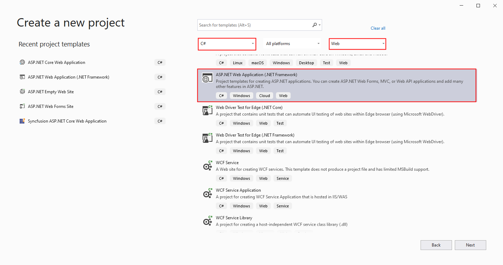
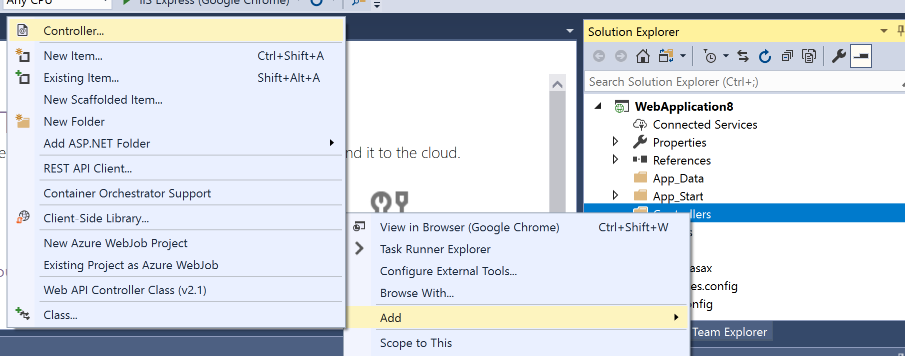
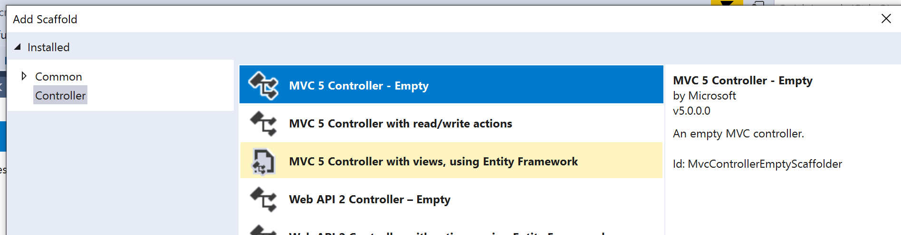
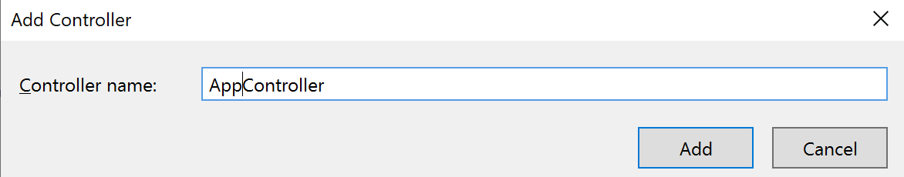
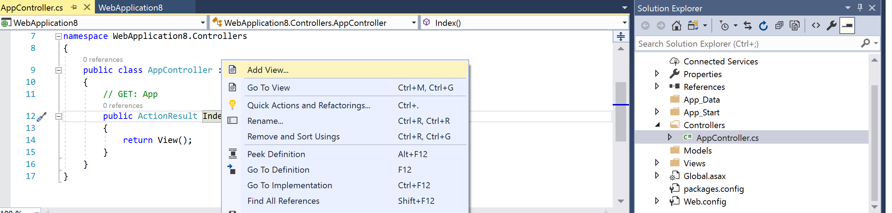
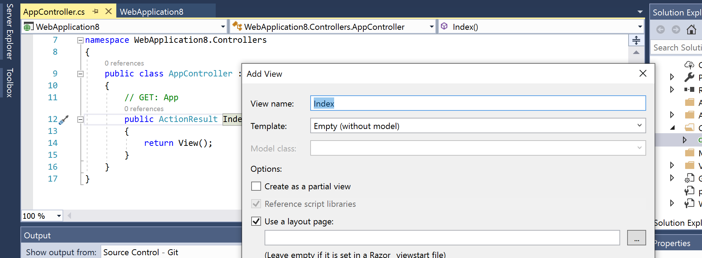
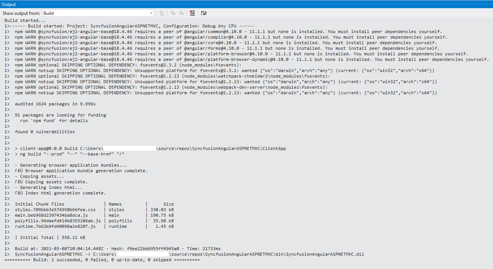

# Getting Started ASP .NET MVC with Angular using Project Template

This document helps you to create a simple ASP.NET MVC application with Angular Framework and Syncfusion Angular UI components (Essential JS 2).

## Prerequisites

Before getting started with Syncfusion Angular Components in ASP.NET MVC with Angular project, check whether the following are installed in the developer machine. 

* .Net Framework 4.5 and above
* ASP.NET MVC 5
* Visual Studio 2017

## Create an Angular application with SystemJS

To create an angular application with SystemJS, refer to [`getting started`](https://ej2.syncfusion.com/angular/documentation/getting-started/systemjs/) document.  

We have created a simple [`angular application with SystemJS`](https://github.com/SyncfusionExamples/EJ2-Angular-using-systemjs) sample using above getting started. We are going to use this sample for creating a simple ASP .NET MVC application with Angular Framework and Syncfusion Angular UI components.

## Create ASP.NET MVC Web application

Create a new project with a project template.

1. Choose File > New > Project in the Visual Studio menu bar.


2. Select Installed > Visual C# > Web and select the required .NET Framework in the drop-down.

3. Select `ASP.NET Web Application` and change the application name, and then click OK.



4. Select `Empty` as a project template and add folders and core references for `MVC` and then click OK. The application is created.


## Add new Controller

Right-click on the `Controllers` folder and click Add > Controller. 



Select `MVC 5 Controller - Empty` and click Add. 



Then named the controller name as `AppController` and click Add. The `AppController.cs` will be created.



Open the `AppController.cs` and add a new view for AppController.



Add the View name as `Index`.



After that, _Layout.cshtml & Bootstrap Content folder will be automatically generated.

## Integrate Angular with ASP .NET MVC project

Copy the `tslint.json` and `package.json` files from the [`angular application with SystemJS`](https://github.com/SyncfusionExamples/EJ2-Angular-using-systemjs) and paste them into the MVC project folder.

Right-Click on the Project name and add a new folder `ClientApp`. 

Copy all the files from the `src` folder of the `angular application with SystemJS` sample and paste into `ClientApp` folder in MVC project.

To restore the packages, right-click the `package.json` file and select `Restore Packages`.

## Configure Systemjs file

The systemjs.config.js file is used for loading all scripts including Angular and Syncfusion into the browser. 

Open `systemjs.config.js` file and change app folder as `ClientApp/app` and change loader as `ClientApp/systemjs-angular-loader.js`.

```typescript
/**
 * System configuration for Angular samples
 * Adjust as necessary for your application needs.
 */
(function (global) {
  System.config({
    paths: {
      // paths serve as alias
      'npm:': 'node_modules/'
    },
    // map tells the System loader where to look for things
    map: {
      // our angular app is within the ClientApp folder
      'app': 'ClientApp/app',

      // angular bundles
      '@angular/core': 'npm:@angular/core/bundles/core.umd.js',
      '@angular/common': 'npm:@angular/common/bundles/common.umd.js',
      '@angular/compiler': 'npm:@angular/compiler/bundles/compiler.umd.js',
      '@angular/platform-browser': 'npm:@angular/platform-browser/bundles/platform-browser.umd.js',
      '@angular/platform-browser-dynamic': 'npm:@angular/platform-browser-dynamic/bundles/platform-browser-dynamic.umd.js',
      '@angular/http': 'npm:@angular/http/bundles/http.umd.js',
      '@angular/router': 'npm:@angular/router/bundles/router.umd.js',
      '@angular/forms': 'npm:@angular/forms/bundles/forms.umd.js',

      //Add Syncfusion packages
      '@syncfusion/ej2-angular-grids':  'npm:@syncfusion/ej2-angular-grids/dist/ej2-angular-grids.umd.min.js',
      '@syncfusion/ej2-angular-base':'npm:@syncfusion/ej2-angular-base/dist/ej2-angular-base.umd.min.js',
      '@syncfusion/ej2-base':'npm:@syncfusion/ej2-base/dist/ej2-base.umd.min.js',
      '@syncfusion/ej2-buttons':'npm:@syncfusion/ej2-buttons/dist/ej2-buttons.umd.min.js',
      '@syncfusion/ej2-grids':'npm:@syncfusion/ej2-grids/dist/ej2-grids.umd.min.js',
      '@syncfusion/ej2-calendars':'npm:@syncfusion/ej2-calendars/dist/ej2-calendars.umd.min.js',
      '@syncfusion/ej2-compression':'npm:@syncfusion/ej2-compression/dist/ej2-compression.umd.min.js',
      '@syncfusion/ej2-data':'npm:@syncfusion/ej2-data/dist/ej2-data.umd.min.js',
      '@syncfusion/ej2-dropdowns':'npm:@syncfusion/ej2-dropdowns/dist/ej2-dropdowns.umd.min.js',
      '@syncfusion/ej2-lists':'npm:@syncfusion/ej2-lists/dist/ej2-lists.umd.min.js',
      '@syncfusion/ej2-navigations':'npm:@syncfusion/ej2-navigations/dist/ej2-navigations.umd.min.js',
      '@syncfusion/ej2-popups':'npm:@syncfusion/ej2-popups/dist/ej2-popups.umd.min.js',
      '@syncfusion/ej2-splitbuttons':'npm:@syncfusion/ej2-splitbuttons/dist/ej2-splitbuttons.umd.min.js',
      '@syncfusion/ej2-excel-export':'npm:@syncfusion/ej2-excel-export/dist/ej2-excel-export.umd.min.js',
      '@syncfusion/ej2-inputs':'npm:@syncfusion/ej2-inputs/dist/ej2-inputs.umd.min.js',
      '@syncfusion/ej2-pdf-export':'npm:@syncfusion/ej2-pdf-export/dist/ej2-pdf-export.umd.min.js',
      '@syncfusion/ej2-file-utils':'npm:@syncfusion/ej2-file-utils/dist/ej2-file-utils.umd.min.js',
      

      // other libraries
      'rxjs':                      'npm:rxjs',
      'angular-in-memory-web-api': 'npm:angular-in-memory-web-api/bundles/in-memory-web-api.umd.js'
    },
    // packages tells the System loader how to load when no filename and/or no extension
    packages: {
      app: {
        defaultExtension: 'js',
        meta: {
          //Change System loader path
          './*.js': {
            loader: 'ClientApp/systemjs-angular-loader.js'
          }
        }
        },
      rxjs: {
        defaultExtension: 'js'
      }
    }
  });
})(this);

```

## Configure RouteConfig.cs file

In the `RouteConfig.cs` file, add the controller name as `App` and action as `Index`.

```typescript
using System;
using System.Collections.Generic;
using System.Linq;
using System.Web;
using System.Web.Mvc;
using System.Web.Routing;

namespace Angular_with_ASP.NET_MVC
{
    public class RouteConfig
    {
        public static void RegisterRoutes(RouteCollection routes)
        {
            routes.IgnoreRoute("{resource}.axd/{*pathInfo}");

            routes.MapRoute(
                name: "Default",
                url: "{controller}/{action}/{id}",
                defaults: new { controller = "App", action = "Index", id = UrlParameter.Optional }
            );
        }
    }
}

```

## Add References to Layout file

To load Angular in ASP.NET MVC, include the script references of Angular core modules and Syncfusion JavaScript asset files in _Layout file, and load the component in index.cshtml.

Add the below code into _Layout.cshtml file.

```typescript
<link rel="stylesheet" href="~/ClientApp/styles.css">
<script src="~/ClientApp/systemjs.config.js"></script>
    <script>
        System.import('/ClientApp/main.js').catch(function (err) { console.error(err); });
</script>

```

Code snippet of _Layout.cshtml file:

```typescript

<!DOCTYPE html>
<html>
<head>
    <meta charset="utf-8" />
    <meta name="viewport" content="width=device-width, initial-scale=1.0">
    <title>@ViewBag.Title - My ASP.NET Application</title>
    <link href="~/Content/Site.css" rel="stylesheet" type="text/css" />
    <link href="~/Content/bootstrap.min.css" rel="stylesheet" type="text/css" />
    <script src="~/Scripts/modernizr-2.8.3.js"></script>
    <base href="/">
    <link href="~/Content/Site.css" rel="stylesheet" type="text/css" />
    <link href="~/Content/bootstrap.css" rel="stylesheet" type="text/css" />

    <!-- Add Grid module style -->
    <link rel="stylesheet" href="~/ClientApp/styles.css">

    <!-- Polyfill(s) for older browsers -->
    <script src="~/node_modules/core-js/client/shim.min.js"></script>
    <script src="~/node_modules/zone.js/dist/zone.js"></script>
    <script src="~/node_modules/systemjs/dist/system.src.js"></script>

    <script src="~/ClientApp/systemjs.config.js"></script>
    <script>
        System.import('/ClientApp/main.js').catch(function (err) { console.error(err); });
    </script>

</head>
<body>

    <div class="container body-content">
        @RenderBody()
        <hr />
        <footer>
            <p>&copy; @DateTime.Now.Year - My ASP.NET Application</p>
        </footer>
    </div>

    <script src="~/Scripts/jquery-3.3.1.min.js"></script>
    <script src="~/Scripts/bootstrap.min.js"></script>
</body>
</html>

```

Code snippet of index.cshtml file:

```typescript
@{
    ViewBag.Title = "Index";
}
<my-app>Loading AppComponent content here ...</my-app>

```

## Run the Application

Run this application and the component will be render.



>Note: For your convenience, we have prepared an [ASP .NET MVC and Angular Sample](https://github.com/SyncfusionExamples/angular-with-asp.net-mvc).