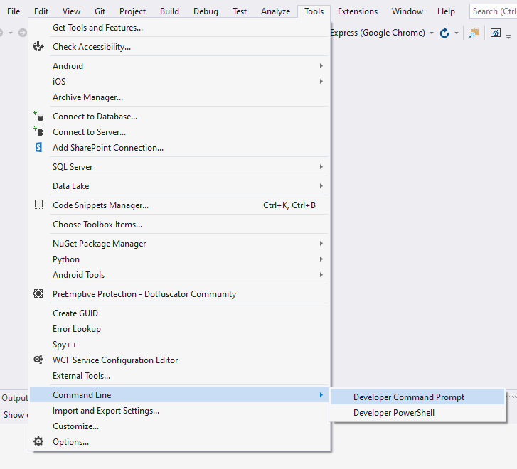
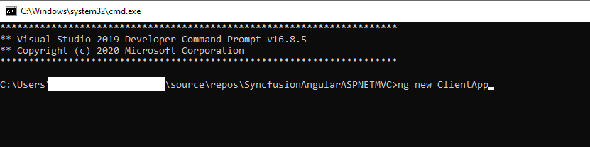
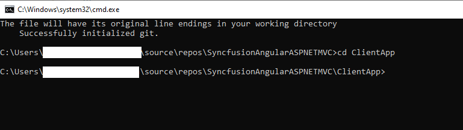

# Getting Started with Angular CLI as Frontend in ASP.NET MVC 

This document explains hoe to create an ASP.NET MVC framework with an Angular CLI project as the frontend and Syncfusion EJ2 Angular components.

## Prerequisite

* .Net Framework 4.5 and above
* ASP.NET MVC 5
* Visual Studio 2017 and above
* NodeJs
* Angular CLI 

## Create ASP.NET MVC Web Application

Create a new ASP.NET MVC Web application using theproject temaplate. 

1. Choose **File** > **New** > **Project** in the Visual Studio menu bar.


2. Select  **Visual C#** and  **Web** in the drop-down.

3. Select `ASP.NET Web Application (.NET Framework)` and change the application name, and then click **OK**.


4. Select `MVC` as a project template and then click **OK**. Now the application is created.


## Create Angular CLI Application 

1. Open the `Developer Command Prompt` from Visual Studio as shown in the following image.



2. Create Angular CLI application using the `ng new ClientApp` command as shown in the following image.



3. Navigate to the ClientApp directory using the `cd ClientApp` command.



4. Integrate the Syncfusion Angular components as described in the [Getting Started with Angular CLI](https://ej2.syncfusion.com/angular/documentation/getting-started/angular-cli/) documentation.

5. Change the production build `outputPath` in `angular.json` file as `../Scripts/ClientApp`.

```json

"projects": {
    "ClientApp": {
      "projectType": "application",
      "schematics": {},
      "root": "",
      "sourceRoot": "src",
      "prefix": "app",
      "architect": {
        "build": {
          "builder": "@angular-devkit/build-angular:browser",
          "options": {
            "outputPath": "../Scripts/ClientApp",

```

## Configuring ASP.NET MVC Application 

### For building Angular application using MSBuild

Installing and building the Angular application can be automated everytime when the MVC application is built by changing MSBuild configuration in `.csproj` as shown in the following code sample.

```xml

    <PropertyGroup>
        <TypeScriptCompileBlocked>true</TypeScriptCompileBlocked>
        <TypeScriptToolsVersion>Latest</TypeScriptToolsVersion>
        <IsPackable>false</IsPackable>
        <SpaRoot>ClientApp\</SpaRoot>
        <DefaultItemExcludes>$(DefaultItemExcludes);$(SpaRoot)node_modules\**</DefaultItemExcludes>
        <BuildServerSideRenderer>false</BuildServerSideRenderer>
    </PropertyGroup>

    <ItemGroup>
        <!-- Don't publish the SPA source files, but do show them in the project files list -->
        <Content Remove="$(SpaRoot)**" />
        <None Remove="$(SpaRoot)**" />
        <None Include="$(SpaRoot)**" Exclude="$(SpaRoot)node_modules\**" />
    </ItemGroup>

    <Target Name="BeforeBuild" AfterTargets="ComputeFilesToPublish">
        <!-- As part of publishing, ensure the JS resources are freshly built in production mode -->
        <Exec WorkingDirectory="$(SpaRoot)" Command="npm install" />
        <Exec WorkingDirectory="$(SpaRoot)" Command="npm run build -- --prod -- --base-href /" />
        <Exec WorkingDirectory="$(SpaRoot)" Command="npm run build:ssr -- --prod" Condition=" '$(BuildServerSideRenderer)' == 'true' " />

        <!-- Include the newly-built files in the publish output -->
        <ItemGroup>
            <DistFiles Include="$(SpaRoot)dist\**; $(SpaRoot)dist-server\**" />
            <DistFiles Include="$(SpaRoot)node_modules\**" Condition="'$(BuildServerSideRenderer)' == 'true'" />
            <ResolvedFileToPublish Include="@(DistFiles->'%(FullPath)')" Exclude="@(ResolvedFileToPublish)">
                <RelativePath>%(DistFiles.Identity)</RelativePath>
                <CopyToPublishDirectory>PreserveNewest</CopyToPublishDirectory>
                <ExcludeFromSingleFile>true</ExcludeFromSingleFile>
            </ResolvedFileToPublish>
        </ItemGroup>
    </Target>

```

### Configure MVC Bundle with Angular production scripts

Configure the MVC bundle with Angular production script and style files in `App_Srart\BundleConfig.cs` as shown in the following code sample.

```cs

using System.Web;
using System.Web.Optimization;

namespace SyncfusionAngularASPNETMVC
{
    public class BundleConfig
    {
        // For more information on bundling, visit https://go.microsoft.com/fwlink/?LinkId=301862
        public static void RegisterBundles(BundleCollection bundles)
        {
            bundles.Add(new Bundle("~/bundles/clientapp").Include(
                "~/Scripts/ClientApp/runtime.*",
                "~/Scripts/ClientApp/polyfills.*",
                "~/Scripts/ClientApp/main.*"));

            bundles.Add(new StyleBundle("~/Content/clientapp").Include(
                      "~/Scripts/ClientApp/styles.*"));

```

### Include Angular production scripts in MVC

Include the Angular production scripts and style files in the `Views/Shared/_Layout.cshtml`.

```html
<!DOCTYPE html>
<html>
<head>
    <meta charset="utf-8" />
    <meta name="viewport" content="width=device-width, initial-scale=1.0">
    <title>@ViewBag.Title - My ASP.NET Application</title>
    <base href="/" />
    @Styles.Render("~/Content/css")
    @Styles.Render("~/Content/clientapp")
    @Scripts.Render("~/bundles/modernizr")
</head>
<body>
    @RenderBody()


    @Scripts.Render("~/bundles/jquery")
    @Scripts.Render("~/bundles/bootstrap")
    @Scripts.Render("~/bundles/clientapp")
    @RenderSection("scripts", required: false)
</body>
</html>

```

Include the `<app-root>` tag in the `Views/Home/index.cshtml`.

```html

@{
    ViewBag.Title = "Home Page";
}

<app-root></app-root>

```
## Run the Application

Build and run this application from Visual Studio and the component will be rendered.


>Note: For your convenience, we have prepared an [ASP .NET MVC and Angular CLI Sample](https://github.com/SyncfusionExamples/Aspnet-mvc-with-angilar-cli).
