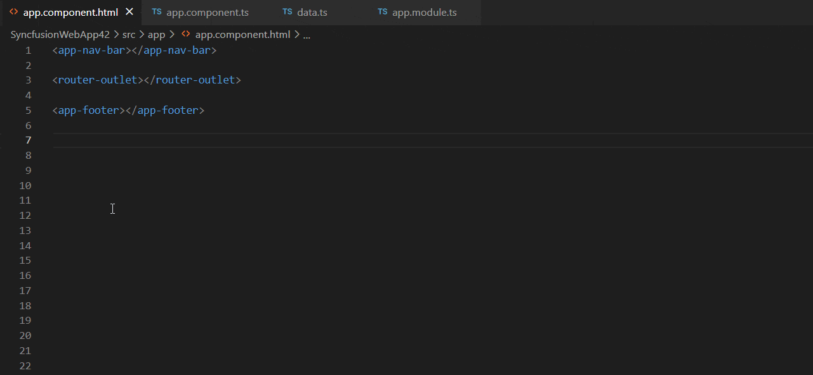
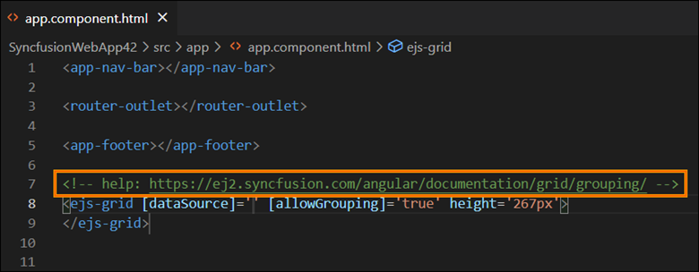
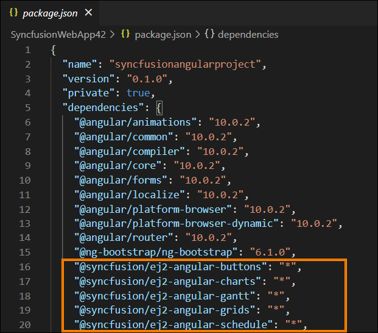
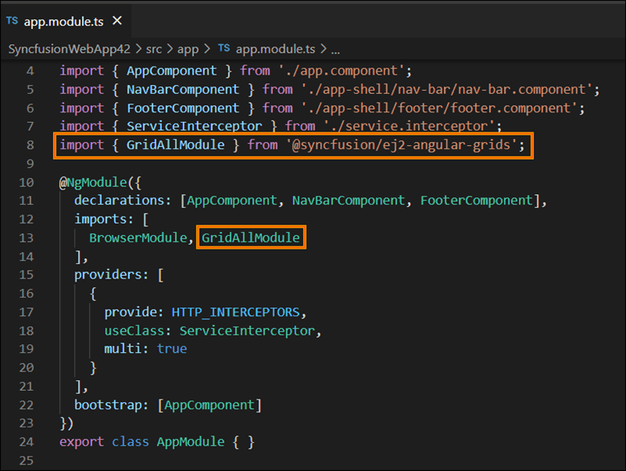

# Add Syncfusion Angular component in the Angular application

The Syncfusion Angular code snippet utility for Visual Studio Code provides snippets for adding a Syncfusion Angular component with various features in the html code editor file of the Angular Application.

   > The Syncfusion Angular code snippet is available from Essential Studio 2021 Vol 3 (`v19.3.0.43`).

## Add a Syncfusion Angular component

The following steps help you to use the Syncfusion Angular code snippet in your Angular Application.

1. In Visual Studio Code, open an existing Angular Application or create a new Angular Application.

2. Open the html file that you need and place the cursor in required place where you want to add Syncfusion component.

3. You can find the Syncfusion Angular component with the various features by typing the **ejs** word in the format shown below.

    ```bash
    ejs-<Syncfusion component name>-<Syncfusion component feature>

    For Example, ejs-grid-grouping
    ```
4. Choose the Syncfusion component and click the **Enter** or **Tab** key, the Syncfusion Angular component will be added in the html file.

    

5. After adding the Syncfusion Angular component to the html file, use the tab key to fill in the required values to render the component with data. You can also find the Syncfusion help link at the top of the added snippet to learn more about the new Syncfusion Angular component feature.

    

## Configure Angular application with Syncfusion

The Syncfusion Angular snippet only add the code snippet alone in the html file. You need to configure the Angular application with Syncfusion by adding the required Syncfusion Angular NPM, component modules, and themes by manually. To configure, refer the steps below:

1. Open the Angular package.json file and add the required Syncfusion Angular individual NPM package(s) for the Syncfusion Angular components manually. Then navigate to the packages.json file location in the command prompt and run the ***npm install*** command to restore all the Syncfusion Angular NPM packages.

    

2. Open your module file and add the required Syncfusion Angular component(s) module entries to render the Syncfusion components in your application.

    

3. Add the Syncfusion Angular [theme](https://ej2.syncfusion.com/documentation/appearance/theme/) entry in the **style.css** file.

    