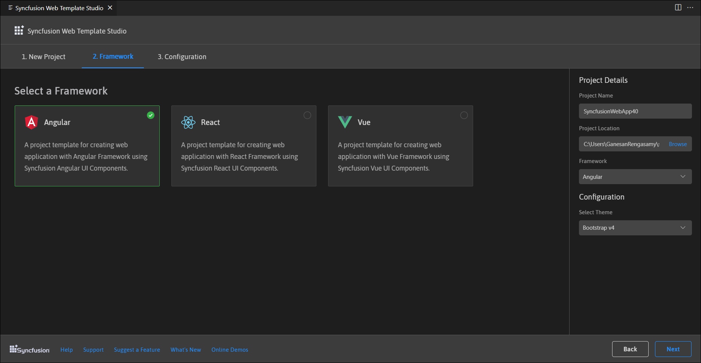
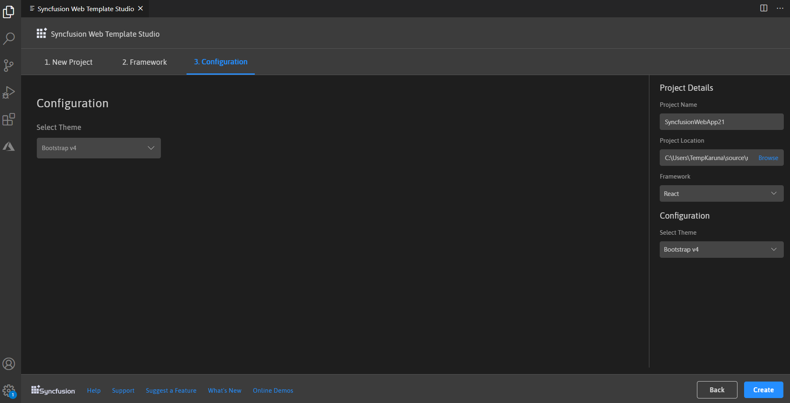
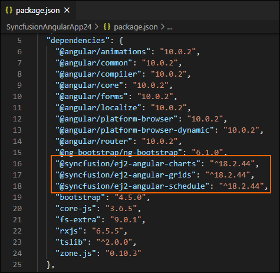
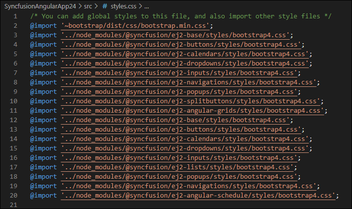
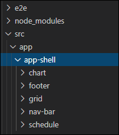
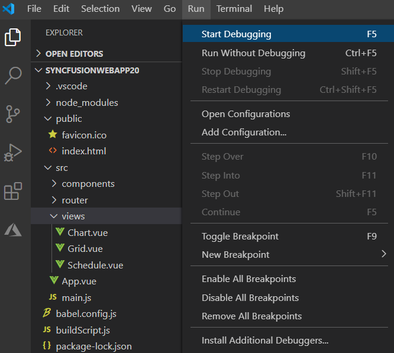

# Visual Studio Code Extensions

## Create project

Syncfusion provides **project templates** for **VisualStudio Code** to create Syncfusion Web applications. Syncfusion Web Project template creates applications with the selected Framework(React, Angular, and Vue), required Syncfusion NPM packages, component render code for the Grid, Chart, Scheduler components, and the style for making development easier with Syncfusion components.

   > The Syncfusion Visual Studio Code project template provides support for Web project templates from v18.3.0.47.

The following steps help you create **Syncfusion Web Applications** through the **Visual Studio Code:**

1. In Visual Studio Code, open the command palette by pressing **Ctrl+Shift+P**. The Visual Studio Code palette opens, search the word **Syncfusion**, so you can get the templates provided.

    

2. Select Syncfusion Web Template Studio: Launch and then press enter, Template Studio wizard for configuring the Syncfusion Web app will appear. Provide the require Project Name and Path to create the new Syncfusion Web application along with any one of the Framework(React, Angular, and Vue).

    

3. Click either **Next** or the **Framework** tab, and the Framework types will be appears. Choose any one of the Framework:
   * React
   * Angular
   * Vue

    

4. Click either Next or the Configuration tab, and the Configuration section will be loaded. Choose the preferred theme and then click Create. The project will be created.

    

5. The created Syncfusion Web App is configured with the Syncfusion NPM packages, styles, and the component render code for the Syncfusion component added.

    

    

    

## Run the application

1. Click on **F5** or navigate to **Debug>Start debugging**

    

2. After compilation process completed, open the local host link in browser to see the output.

    