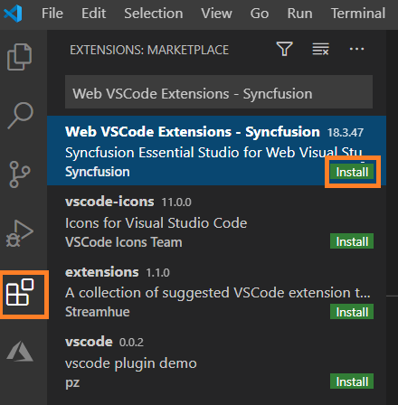
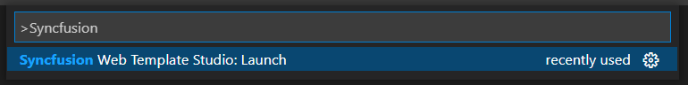

# Download and Installation

Syncfusion publishes the Visual Studio Code extension in [Visual Studio Code marketplace](https://marketplace.visualstudio.com/items?itemName=SyncfusionInc.Angular-VSCode-Extensions). You can either install it from Visual Studio Code or download and install it from the Visual Studio Code marketplace.

## Prerequisites

The following prerequisites software needs to be installed for the Syncfusion Web extension installation and for creating the Syncfusion Web applications along with any one of the Framework(React, Angular, and Vue).

* [Visual Studio Code](https://code.visualstudio.com/download)

 > The minimum version of the Visual Studio Code is 1.38.0 to use the Syncfusion Web Extension.

* [C# Extension](https://marketplace.visualstudio.com/items?itemName=ms-vscode.csharp)

* [Node.js](https://nodejs.org/en/download/)

## Install through the Visual Studio Code Extensions

The following steps explain how to install the Syncfusion Web extensions from Visual Studio Code Extensions.

1. Open Visual Studio Code.

2. Go to **View > Extensions**, and open Manage Extensions.

3. Type **“Syncfusion Web** in the search box.

     

4. Click the Install button on the **"Web VSCode Extensions - Syncfusion"** extension.

5. After the installation, reload the Visual Studio Code using the **Reload Required** in Visual Studio Code palette.

6. Now, use the Syncfusion Web extensions from the Visual Studio Code palette.

     

## Install from the Visual Studio Code Marketplace

The following steps explain how to download Syncfusion Web applications from the Visual Studio Code Marketplace and install them.

1. Open the [Syncfusion Web Extension](https://marketplace.visualstudio.com/items?itemName=SyncfusionInc.Web-VSCode-Extensions)

2. Click Install from Visual Studio Code Marketplace. The browser opens the popup with the information like **“Open Visual Studio Code”**. Click Open Visual Studio Code, then [Syncfusion Web Extension](https://marketplace.visualstudio.com/items?itemName=SyncfusionInc.Angular-VSCode-Extensions) will open in Visual Studio Code.

3. Click the Install button in the **"Web VSCode Extensions - Syncfusion"** extension.

4. After the installation, reload the Visual Studio Code using the Reload Required in Visual Studio Code palette.

5. Now, use the Syncfusion Web extensions from the Visual Studio Code palette.

     