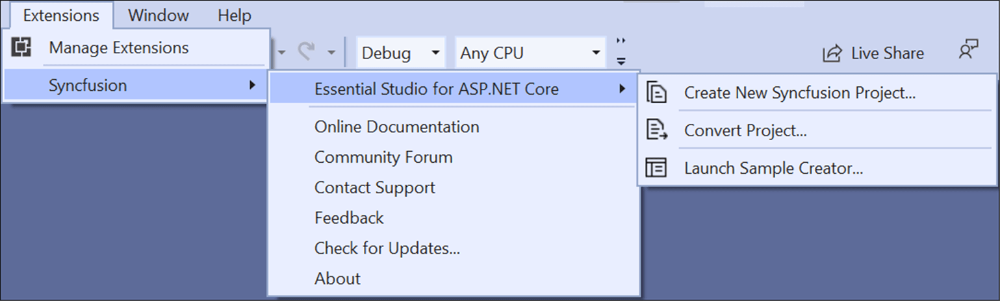
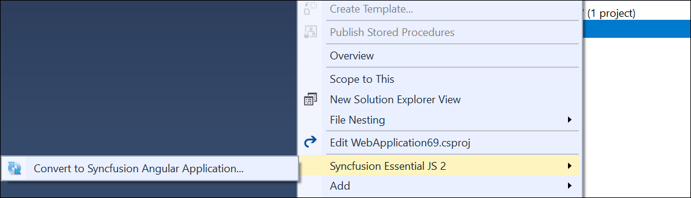
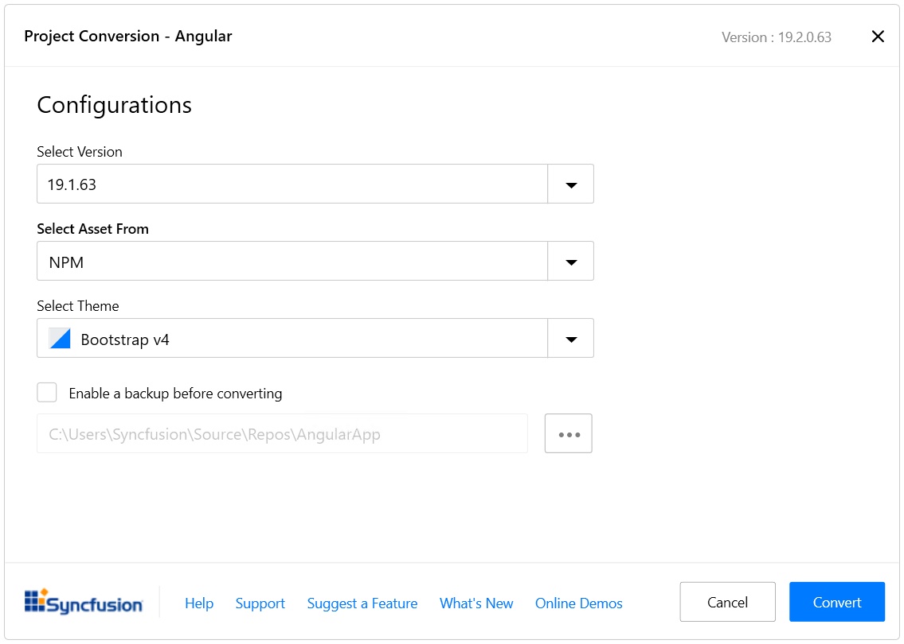
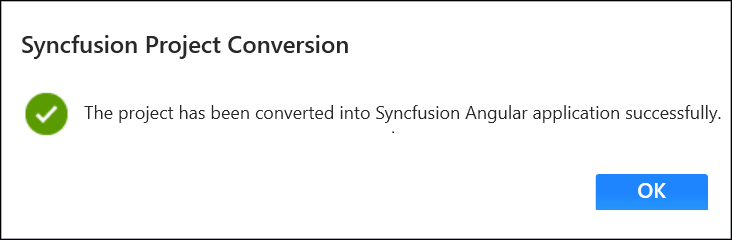
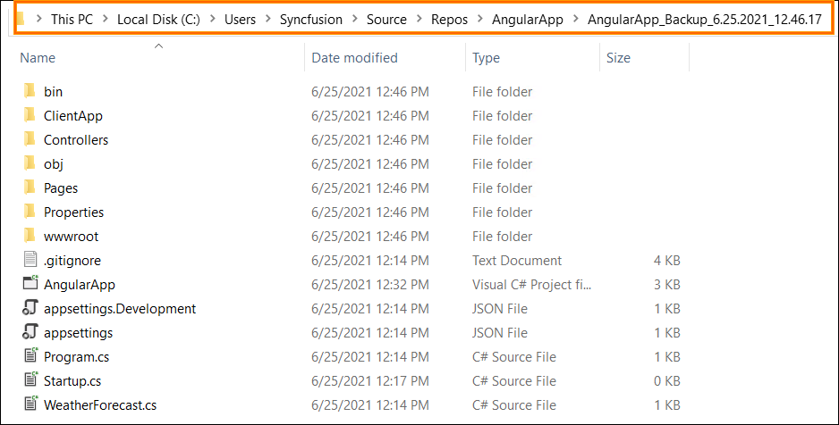
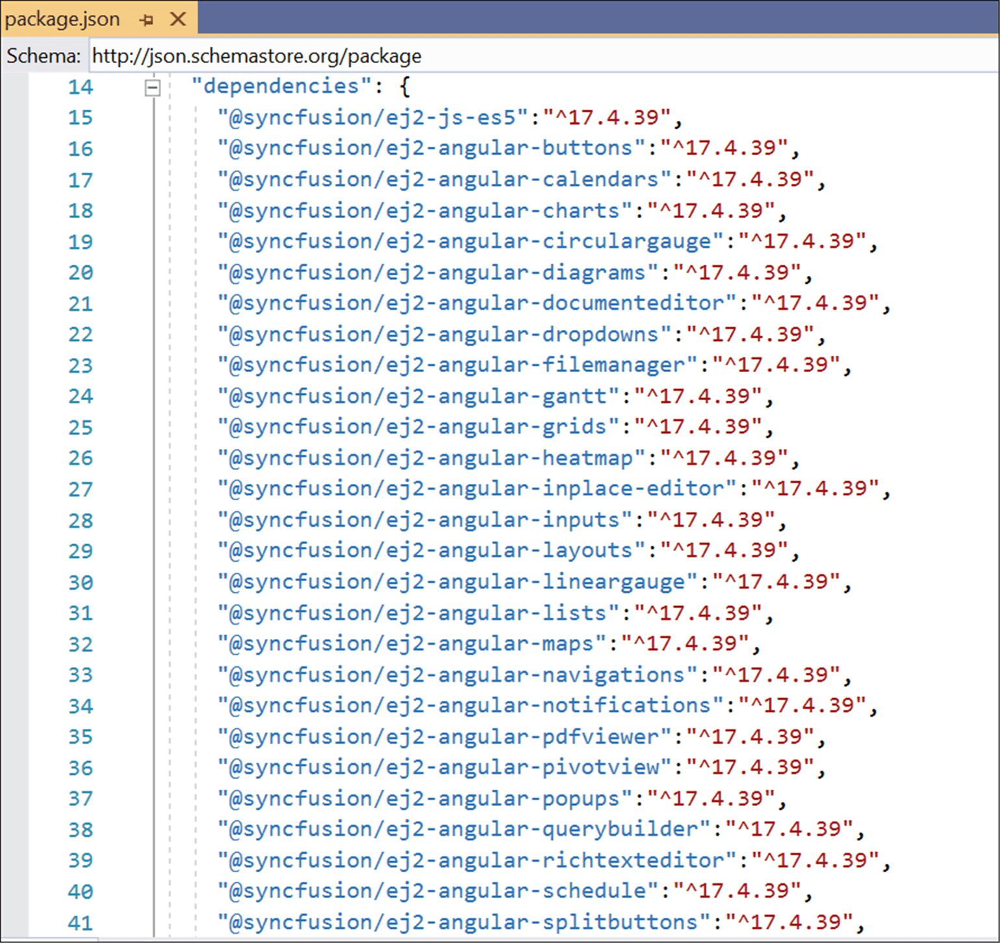
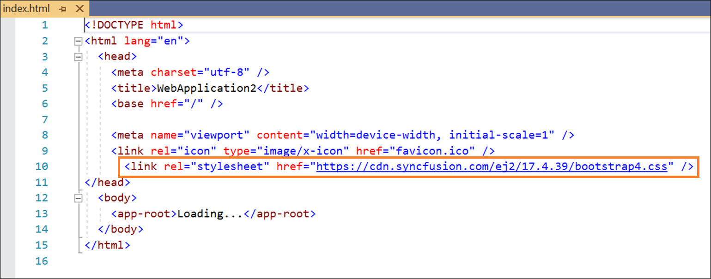
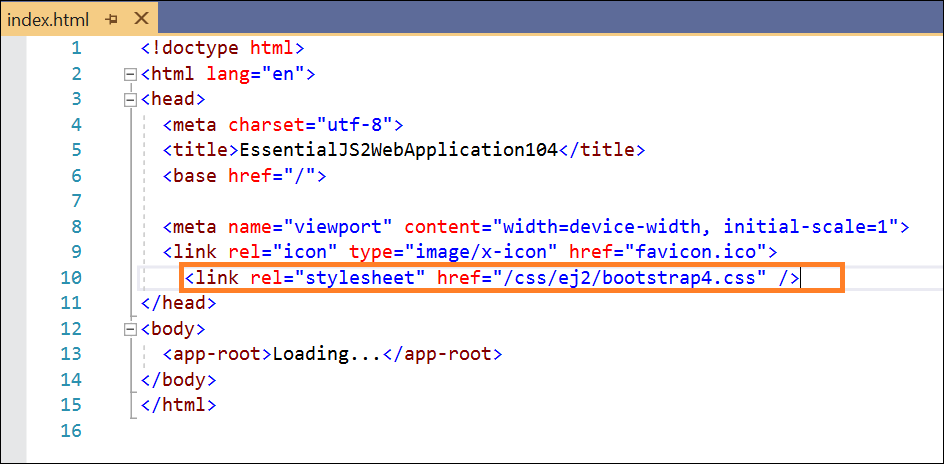

# Convert Project

Syncfusion Angular conversion is a Visual Studio add-in that converts an existing Angular application into a Syncfusion Angular Web application.

> The Syncfusion Angular Project conversion are available from v17.3.0.9.

The steps below help you to convert the Angular application to Syncfusion Angular application through the Visual Studio:

1. Open your existing Angular application or create a new Angular application

2. To open the Syncfusion Project Conversion Wizard, follow either one of the options below:

    **Option 1:**

    Choose **Extensions-> Syncfusion-> Essential Studio for ASP.NET Core ->Convert Project…** in **Visual Studio 2019** menu.

    

    **Option 2:**

    Right-click on the **Angular Application** from the Solution Explorer and select the **Syncfusion Web** and choose the **Convert to Syncfusion Angular application...**

    

3. The **Syncfusion Angular Project Conversion** window will appear. You can choose the required version of Syncfusion Angular version, Assets from, and Themes to convert the application.

    

    > The Syncfusion Angular versions are loaded from published Syncfusion Angular NPM package versions and it requires the internet connectivity.

    The following configurations are used in the Project conversion wizard.

    **Assets From:** Load the Syncfusion Essential JS 2 assets to Angular Project, from either NPM, CDN, or Installed Location.

    > Installed location option will be available only when the Syncfusion Essential JavaScript 2 setup has been installed.

    **Choose the Theme:** Choose the required theme.

4. Check the **“Enable a backup before converting”** checkbox if you want to take the project backup and choose the location.

5. Once the conversion process completed, will get the success message window.

    

    if you enabled project backup before converting, the old project was saved in the specified backup path location, as shown below once the conversion process completed.

    

## Convert changes

The Syncfusion NPM packages and selected Style link will be updated with the selected Syncfusion Angular version in the Angular application.

## Npm packages

The installed Syncfusion Angular NPM packages are updated with the selected Syncfusion Angular version in ClientApp/package.json file.

## CDN Style Link

The selected Syncfusion Angular version updated in the ClientApp/src/index.html file with cdn link.

## NPM Style Link

The selected Syncfusion Angular version updated in the ClientApp/src/index.html file from npm package.

