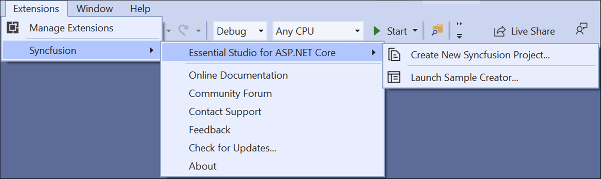
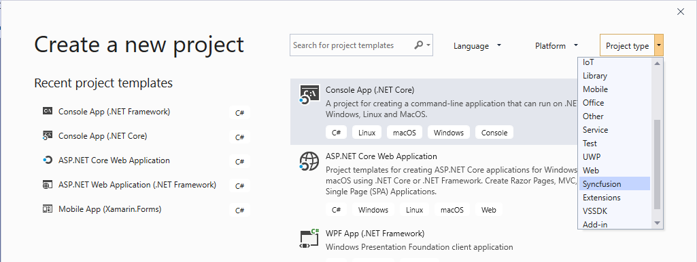
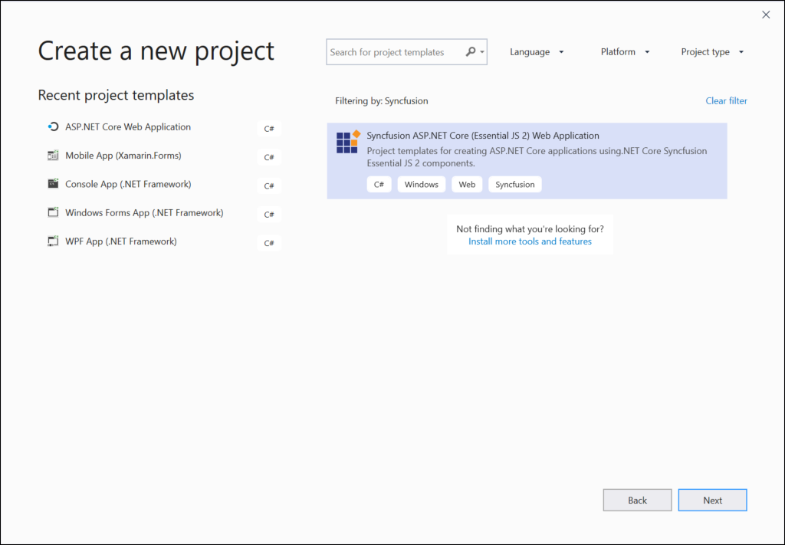

# Visual Studio Extensions

## Create project

Syncfusion provides the **Visual Studio Project Templates** for create the Syncfusion Angular Application. The Syncfusion Angular application creates the application with the required Syncfusion references, namespaces and CDN links for making the development earlier with the Syncfusion components.

> The Syncfusion Angular project templates are available from v17.1.0.47.

The following steps help you to create the Syncfusion Angular application through the Visual Studio:

1. Open the Visual Studio 2017 or Visual Studio 2019.

2. To create a Syncfusion Angular project, follow either one of the options below:
  
    **Option 1:**

      Choose the **Extension->Syncfusion-> Essential Studio for ASP.NET Core -> Create New Syncfusion Project…** in Visual Studio menu.

    

     **Option 2:**

       Choose **File > New > Project in Visual Studio**. The Create a new project dialog opens. You can get the **Syncfusion** provided templates by filtering the Project type with Syncfusion or use the **Search option** with the key word of Syncfusion.

    

3. Select the Syncfusion ASP.NET Core (Essential JS2) Web Application and choose the Next button.

    

4. Name the Project, choose the destination location and then click Create button. The Syncfusion ASP.NET Core (Essential JS2)  project configuration wizard appears.

    

    Choose the Syncfusion Angular template and choose required theme and asset.

5. Click the Create button, the Syncfusion Angular application has been created.

6. The created Syncfusion Angular application configured with Syncfusion.

7. You can run the application and see the Syncfusion components.

### Syncfusion integration

Syncfusion adds the required latest version of Syncfusion NPM packages and Style links.

#### NPM packages

The following NPM package are added in syncfusion angular application in package.json file.  

#### Style links

Selected theme (while creating the project) are added based on selected assets.

If selected assets is **CDN**, style link is added with cdn link in ClientApp/src/index.html file.

If selected assets is **NPM**, style is referred from installed npm package in ClientApp/src/index.html file.

