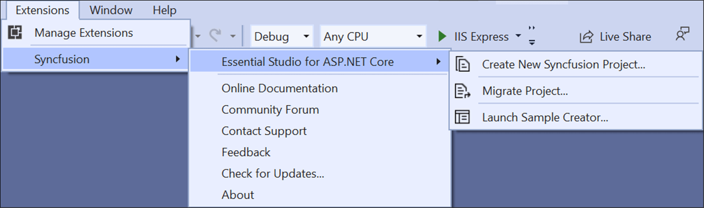
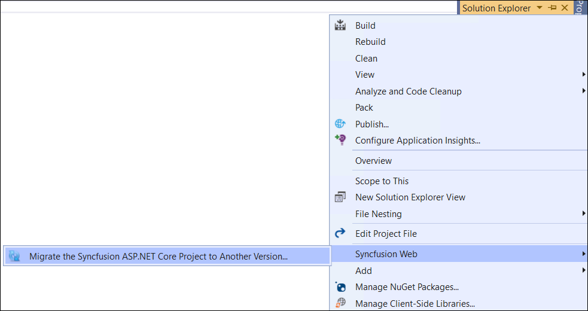
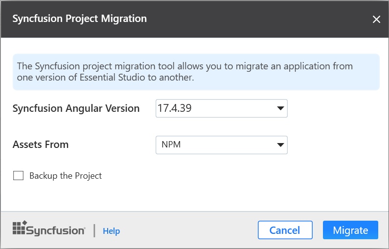
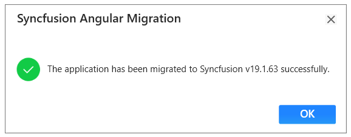

# Upgrade Project

The Syncfusion Angular migration add-in for Visual Studio allows you to migrate an existing Syncfusion Angular application from one version of Essential Studio version to another version. This reduces the amount of manual work required when migrating the Syncfusion version.

> The Syncfusion Angular Project migration are available from v17.3.0.9.

The steps below help you to upgrade the Syncfusion version in **Syncfusion Angular Application** through the **Visual Studio**:

1. Open the Syncfusion Angular application which uses the Syncfusion component.

2. To open Migration Wizard, follow either one of the options below:

    **Option 1:**

    Choose **Extensions-> Syncfusion-> Essential Studio for ASP.NET Core ->Migrate Project…** in **Visual Studio** menu.

    

    **Option 2:**

    Right-click on the **Application** from the **Solution Explorer** and select the **Syncfusion Web** and choose the **Migrate the Syncfusion ASP.NET Core Project to Another version…**

    

3. The Syncfusion Project Migration window will appear. You can choose the required version of Syncfusion ANGULAR to migrate.

    > The Syncfusion Angular versions are loaded from published Syncfusion angular NPM packages and it requires the internet connectivity.

    

    **Assets From:** Load the Syncfusion Essential JS 2 assets to Angular Project, from either NPM, CDN, or Installed Location.

    > Installed location option will be available only when the Syncfusion Essential JavaScript 2 setup has been installed.

4. Check the **“Enable a backup before migrating** checkbox if you want to take the project backup and choose the location.

5. Once the migration process completed, will get the success message window.

    

    if you enabled project backup before migrating, the old project was saved in the specified backup path location, as shown below once the migration process completed

    

6. The Syncfusion Angular NPM packages, and CSS are updated to the respective version in the project.

## Upgraded changes

The Syncfusion NPM packages and Style link will be updated with the selected Syncfusion Angular version in the Syncfusion Project Migration.

## Npm packages

The installed Syncfusion Angular NPM packages are updated with the selected Syncfusion Angular version in ClientApp/package.json file.

## CDN Style Link

The selected Syncfusion Angular version updated in the ClientApp/src/index.html file with cdn link.

## NPM Style Link

The selected Syncfusion Angular version updated in the ClientApp/src/index.html file from npm package.

