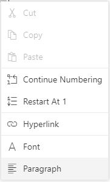

# Working with Lists

Document editor supports both the single-level and multilevel lists. Lists are used to organize data as step-by-step instructions in documents for easy understanding of key points. You can apply list to the paragraph either using supported APIs.

## Create bullet list

Bullets are usually used for unordered lists. To apply bulleted list for selected paragraphs, use the following method of ‘Editor’ instance.

> applyBullet(bullet, fontFamily);

|Parameter|Type|Description|
|---------|----|-----------|
|Bullet|string|Bullet character.|
|fontFamily|string|Bullet font family.|

Refer to the following sample code.

```typescript
this.documentEditor.editor.applyBullet('\uf0b7', 'Symbol');
```

## Create numbered list

Numbered lists are usually used for ordered lists. To apply numbered list for selected paragraphs, use the following method of ‘Editor’ instance.

> applyNumbering(numberFormat,listLevelPattern)

|Parameter|Type|Description|
|---------|----|-----------|
|numberFormat|string|“%n” representations in ‘numberFormat’ parameter will be replaced by respective list level’s value.“%1)” will be displayed as “1)”|
|listLevelPattern(optional)|string|Default value is 'Arabic'.|

Refer to the following example.

```typescript
this.documentEditor.editor.applyNumbering('%1)', 'UpRoman');
```

## Clear list

You can also clear the list formatting applied for selected paragraphs. Refer to the following sample code.

```typescript
this.documentEditor.editor.clearList();
```

## Working with lists

The following sample demonstrates how to create bullet and numbering lists in document editor.



```typescript
import { Component, ViewEncapsulation, ViewChild } from '@angular/core';
import {
    DocumentEditorComponent, EditorService, SelectionService, EditorHistoryService , SfdtExportService
} from '@syncfusion/ej2-angular-documenteditor';

@Component({
    selector: 'app-container',
    styleUrls: ['styles.css'],
    template: `<div style="width:100%;height:330px">
    <div>
        <ejs-toolbar (clicked)='toolbarButtonClick($event)'>
            <e-items>
                <e-item prefixIcon="e-de-icon-Bullets" tooltipText="Bullets" id="Bullets"></e-item>
                <e-item prefixIcon="e-de-icon-Numbering" tooltipText="Numbering" id="Numbering"></e-item>
                <e-item text="Clear" id="clearlist" tooltipText="Clear List"></e-item>
            </e-items>
        </ejs-toolbar>
      </div>
  <ejs-documenteditor #document_editor [enableSelection]='true' [isReadOnly]='false' [enableEditor]=true [enableEditorHistory]=true [enableSfdtExport]=true style="display:block;width: 100%;height: 100%;"></ejs-documenteditor>
    </div>`,
    encapsulation: ViewEncapsulation.None,
    providers:[EditorService, SelectionService, EditorHistoryService , SfdtExportService]
})

export class AppComponent {
 @ViewChild('document_editor')
 public documentEditor: DocumentEditorComponent;

public toolbarButtonClick(args: any) {
    switch (args.item.id) {
    case 'Bullets':
      //To create bullet list
      this.documentEditor.editor.applyBullet('\uf0b7', 'Symbol');
      break;
    case 'Numbering':
      //To create numbering list
      this.documentEditor.editor.applyNumbering('%1)', 'UpRoman');
      break;
    case 'clearlist':
      //To clear list
      this.documentEditor.editor.clearList();
      break;
  }
}

}

```



## Editing numbered list

Document editor restarts the numbering or continue numbering for a numbered list. These options are found in the built-in context menu, if the list value is selected. Refer to the following screenshot.



## See Also

* [List dialog](../document-editor/dialog#list-dialog/)
