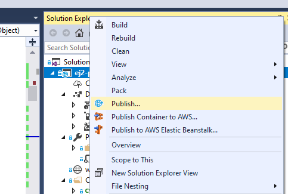
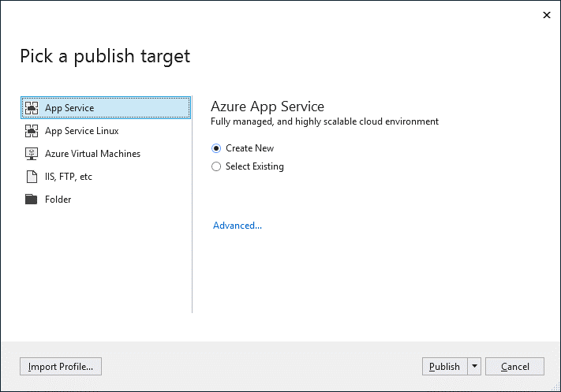
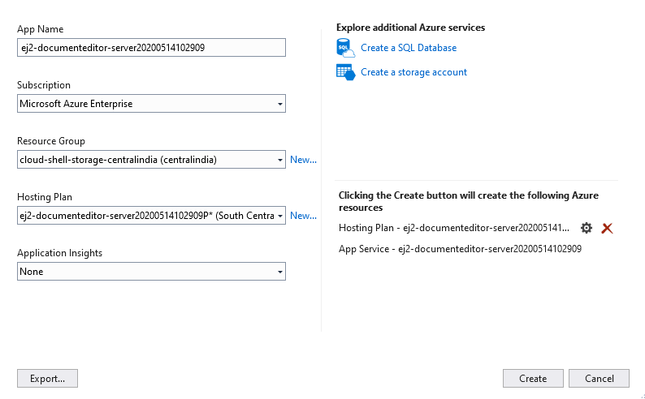

# How to Publish Document Editor Web API Application in Azure App Service from Visual Studio

## Prerequisites

* Visual Studio 2017 or 2019.
* An [`Azure subscription`](https://azure.microsoft.com/en-gb/).
* The Document Editor Web API controller application from [`here`](https://github.com/SyncfusionExamples/EJ2-DocumentEditor-WebServices).

Make sure you build the project using the Build > Build Solution menu command before following the deployment steps.

## Publish to Azure App Service

**Step 1:** In Solution Explorer, right-click the project and click Publish (or use the Build > Publish menu item).

**Step 2:** If you have previously configured any publishing profiles, the Publish pane appears, in which case select Create new profile.

**Step 3:** In the Pick a publish target dialog box, select App Service.

**Step 4:** Select Publish. The Create App Service dialog box appears. Sign in with your Azure account, if necessary, and then the default app service settings populate the fields.

**Step 5:** Select Create. Visual Studio deploys the app to your Azure App Service, and the web app loads in your browser with the app name at `http://<app_name>.azurewebsites.net` (i.e. `http://ej2-documenteditor-server20200514102909.azurewebsites.net`).

**Step 6:** Navigate to Document Editor Web API control `http://ej2-documenteditor-server20200514102909.azurewebsites.net/api/documenteditor`. It returns the default get method response.

Append the app service running the URL `http://ej2-documenteditor-server20200514102909.azurewebsites.net/api/documenteditor` to the service URL in the client-side Document Editor control. For more information about how to get started with the Document Editor control, refer to this [`getting started page`](https://ej2.syncfusion.com/javascript/documentation/document-editor/getting-started).

For more information about the app container service, please look deeper into the [`Microsoft Azure App Service`](https://docs.microsoft.com/en-us/visualstudio/deployment/) for a production-ready setup.
