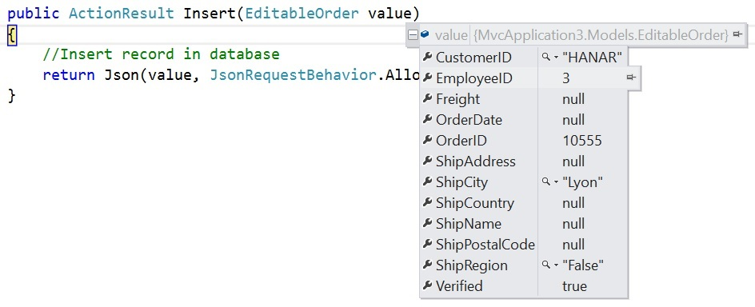
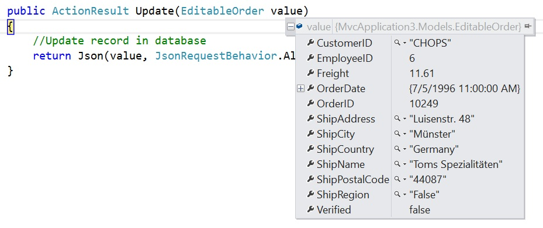
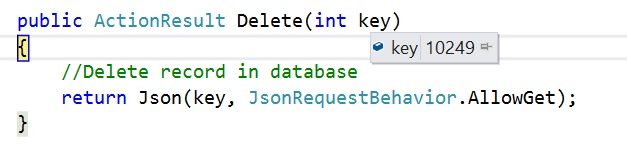
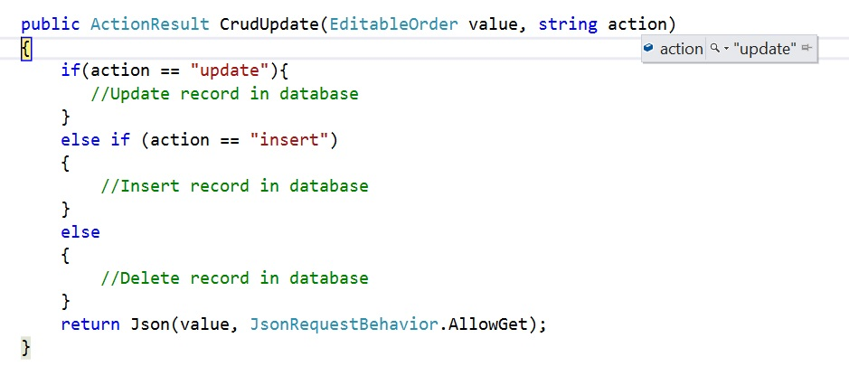
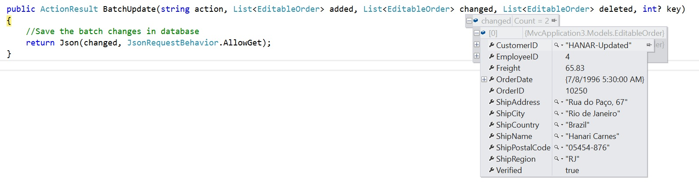

# Editing

The Grid component has options to dynamically insert, delete and update records.
Editing feature requires a primary key column for CRUD operations.
To define the primary key, set [`columns.isPrimaryKey`](../api/grid/column/#isprimarykey) to **true** in particular column.

You can start the edit action either by double clicking the particular row or by selecting the required row and click on **Edit**
button in the toolbar. Similarly, you can add a new record to grid either by clicking on **Add** button in the toolbar
or on an external button which is bound to invoke the [`addRecord`](../api/grid/edit/#addrecord) method of the grid,
**Save** and **Cancel** while in edit mode is possible using respective toolbar icon in grid.

Deletion of the record is possible by selecting the required row and click on **Delete** button in the toolbar.

To use CRUD, inject the [`EditService`](../api/grid/edit) module into the **@NgModule.providers** section.

To learn about what are all the edit modes and edit types are available in Angular Grid, you can check on this video

`youtube:RefC_z4Nnmg`



```typescript
import { Component, OnInit } from '@angular/core';
import { data } from './datasource';
import { EditSettingsModel } from '@syncfusion/ej2-angular-grids';

@Component({
    selector: 'app-root',
    template: `<ejs-grid [dataSource]='data' [editSettings]='editSettings' height='315px'>
                <e-columns>
                    <e-column field='OrderID' headerText='Order ID' textAlign='Right' isPrimaryKey='true' width=100></e-column>
                    <e-column field='CustomerID' headerText='Customer ID' width=120></e-column>
                    <e-column field='Freight' headerText='Freight' textAlign= 'Right' width=120 format= 'C2'></e-column>
                    <e-column field='ShipCountry' headerText='Ship Country' width=150></e-column>
                </e-columns>
                </ejs-grid>`
})
export class AppComponent implements OnInit {

    public data: object[];
    public editSettings: EditSettingsModel;

    ngOnInit(): void {
        this.data = data;
        this.editSettings = { allowEditing: true, allowAdding: true, allowDeleting: true };
    }
}

```



> * If [`columns.isIdentity`](../api/grid/column/#isidentity) is enabled,
then it will be considered as a read-only column when editing and adding a record.
> * You can disable editing for a particular column, by specifying
[`columns.allowEditing`](../api/grid/column/#allowediting) to **false**.

## Toolbar with edit option

The grid toolbar has the [built-in items](../../toolbar/item-configuration) to execute Editing actions.
You can define this by using the [`toolbar`](../api/grid/#toolbar) property.



```typescript
import { Component, OnInit } from '@angular/core';
import { data } from './datasource';
import { EditSettingsModel, ToolbarItems } from '@syncfusion/ej2-angular-grids';

@Component({
    selector: 'app-root',
    template: `<ejs-grid [dataSource]='data' [editSettings]='editSettings' [toolbar]='toolbar' height='273px'>
                <e-columns>
                    <e-column field='OrderID' headerText='Order ID' textAlign='Right' isPrimaryKey='true' width=100></e-column>
                    <e-column field='CustomerID' headerText='Customer ID' width=120></e-column>
                    <e-column field='Freight' headerText='Freight' textAlign= 'Right' width=120 format= 'C2'></e-column>
                    <e-column field='ShipCountry' headerText='Ship Country' width=150></e-column>
                </e-columns>
                </ejs-grid>`
})
export class AppComponent implements OnInit {

    public data: object[];
    public editSettings: EditSettingsModel;
    public toolbar: ToolbarItems[];

    ngOnInit(): void {
        this.data = data;
        this.editSettings = { allowEditing: true, allowAdding: true, allowDeleting: true };
        this.toolbar = ['Add', 'Edit', 'Delete', 'Update', 'Cancel'];
    }
}

```



## Cell edit type and its params

The [`columns.editType`](../api/grid/column/#edittype) is used to define the editor component for any particular column.
You can set the [`columns.editType`](../api/grid/column/#edittype) based on data type of the column.

* [`NumericTextBox`](../numerictextbox) component for integers, double, and decimal data types.

* [`TextBox`](../textbox) component for string data type.

* [`DropDownList`](../drop-down-list) component to show all unique values related to that field.

* [`CheckBox`](../check-box) component for boolean data type.

* [`DatePicker`](../datepicker) component for date data type.

* [`DateTimePicker`](../datetimepicker) component for date time data type.

Also, you can customize the behavior of the editor component through the [`columns.edit.params`](../api/grid/column/#edit).

The following table describes editor component and their example edit params of the column.

Component |Example
-----|-----
[`NumericTextBox`](../numerictextbox) | params: { decimals: 2, value: 5 }
[`DropDownList`](../drop-down-list) | params: { value: 'Germany' }
[`Checkbox`](../check-box) | params: { checked: true}
[`DatePicker`](../datepicker) | params: { format:'dd.MM.yyyy' }
[`DateTimePicker`](../datetimepicker) | params: { value: new Date() }



```typescript
import { Component, OnInit } from '@angular/core';
import { EditSettingsModel, ToolbarItems, IEditCell } from '@syncfusion/ej2-angular-grids';
import { data } from './datasource';

@Component({
    selector: 'app-root',
    template: `<ejs-grid [dataSource]='data' [editSettings]='editSettings' [toolbar]='toolbar' height='273px'>
                <e-columns>
                    <e-column field='OrderID' headerText='Order ID' textAlign='Right' isPrimaryKey='true' width=100></e-column>
                    <e-column field='CustomerID' headerText='Customer ID' width=120></e-column>
                    <e-column field='Freight' headerText='Freight' textAlign= 'Right'
                     editType= 'numericedit' [edit]='numericParams' width=120 format= 'C2'></e-column>
                    <e-column field='ShipCountry' headerText='Ship Country' editType= 'dropdownedit' [edit]='ddParams' width=150></e-column>
                    <e-column field='OrderDate' headerText='Order Date' editType= 'datepickeredit' [edit]='dpParams' width=150></e-column>
                    <e-column field='Verified' headerText='Verified' editType= 'booleanedit' [edit]='boolParams' width=150></e-column>
                </e-columns>
                </ejs-grid>`
})
export class AppComponent implements OnInit {

    public data: object[];
    public editSettings: EditSettingsModel;
    public toolbar: ToolbarItems[];
    public numericParams: IEditCell;
    public ddParams: IEditCell;
    public dpParams: IEditCell;
    public boolParams: IEditCell;

    ngOnInit(): void {
        this.data = data;
        this.editSettings = { allowEditing: true, allowAdding: true, allowDeleting: true };
        this.toolbar = ['Add', 'Edit', 'Delete', 'Update', 'Cancel'];
        this.numericParams = { params: { decimals: 2, value: 5 } };
        this.ddParams = { params: { value: 'Germany' } };
        this.dpParams = { params: {value: new Date() } };
        this.boolParams = { params: {checked: true } };
    }
}


```



> If edit type is not defined in the column, then it will be considered as the **stringedit** type (Textbox component) .

## Cell Edit Template

The cell edit template is used to add a custom component for a particular column by invoking the following functions:

* **create** - It is used to create the element at the time of initialization.

* **write** - It is used to create custom component or assign default value at the time of editing.

* **read** - It is used to read the value from the component at the time of save.

* **destroy** - It is used to destroy the component.



```typescript
import { Component, OnInit } from '@angular/core';
import { DatePicker } from '@syncfusion/ej2-calendars';
import { data } from './datasource';
import { Column, EditSettingsModel, ToolbarItems, IEditCell } from '@syncfusion/ej2-angular-grids';

@Component({
    selector: 'app-root',
    template: `<ejs-grid [dataSource]='data' [editSettings]='editSettings' [toolbar]='toolbar' height='273px'>
                <e-columns>
                    <e-column field='OrderID' headerText='Order ID' textAlign='Right' isPrimaryKey='true' width=100></e-column>
                    <e-column field='CustomerID' headerText='Customer ID' width=120></e-column>
                    <e-column field='Freight' headerText='Freight' textAlign= 'Right'
                     editType= 'numericedit' width=120 format= 'C2'></e-column>
                    <e-column field='OrderDate' headerText='Order Date' type= 'date' format= 'yMd' [edit]='dpParams' width=150></e-column>
                </e-columns>
                </ejs-grid>`
})
export class AppComponent implements OnInit {

    public data: object[];
    public editSettings: EditSettingsModel;
    public toolbar: ToolbarItems[];
    public elem: HTMLElement;
    public datePickerObj: DatePicker;
    public dpParams: IEditCell;

    ngOnInit(): void {
        this.data = data;
        this.editSettings = { allowEditing: true, allowAdding: true, allowDeleting: true };
        this.toolbar = ['Add', 'Edit', 'Delete', 'Update', 'Cancel'];
        this.dpParams = {
            create: () => {
                this.elem = document.createElement('input');
                return this.elem;
            },
            read: () => {
                return this.datePickerObj.value;
            },
            destroy: () => {
                this.datePickerObj.destroy();
            },
            write: (args: { rowData: object, column: Column }) => {
                this.datePickerObj = new DatePicker({
                    value: new Date(args.rowData[args.column.field]),
                    floatLabelType: 'Never'
                });
                this.datePickerObj.appendTo(this.elem);
            }
        };
    }
}

```



### Using template

The cell editor for a particular column can be specified using the content of the NgTemplate. The [`#editTemplate`](../api/grid/column/#edittemplate-string) template variable identifies the NgTemplate content as the corresponding column editor.



```typescript
import { Component, OnInit } from '@angular/core';
import { data } from './datasource';
import { EditSettingsModel, ToolbarItems, SaveEventArgs } from '@syncfusion/ej2-angular-grids';

@Component({
    selector: 'app-root',
    template: `<ejs-grid [dataSource]='data' [editSettings]='editSettings' [toolbar]='toolbar' height='273px'
                (actionBegin)='actionBegin($event)'>
                <e-columns>
                    <e-column field='OrderID' headerText='Order ID' textAlign='Right' isPrimaryKey='true' width=100></e-column>
                    <e-column field='CustomerID' headerText='Customer ID' width=120></e-column>
                    <e-column field='Freight' headerText='Freight' textAlign= 'Right'
                     editType= 'numericedit' width=120 format= 'C2'></e-column>
                    <e-column field='OrderDate' headerText='Order Date' type= 'date' format= 'yMd' width=150>
                        <ng-template #editTemplate let-data>
                            <ejs-datepicker id="OrderDate" placeholder="Order Date"
                            [(ngModel)]="orderData.OrderDate" floatLabelType='Never'></ejs-datepicker>
                        </ng-template>
                    </e-column>
                </e-columns>
                </ejs-grid>`
})
export class AppComponent implements OnInit {

    public data: object[];
    public editSettings: EditSettingsModel;
    public toolbar: ToolbarItems[];
    public orderData: object;
    ngOnInit(): void {
        this.data = data;
        this.editSettings = { allowEditing: true, allowAdding: true, allowDeleting: true, mode: 'Normal' };
        this.toolbar = ['Add', 'Edit', 'Delete', 'Update', 'Cancel'];
    }
    actionBegin(args: SaveEventArgs) {
        if (args.requestType === 'beginEdit' || args.requestType === 'add') {
            this.orderData = Object.assign({}, args.rowData);
        }
        if (args.requestType === 'save') {
            // cast string to integer value.
            const OrderDate = 'OrderDate';
            args.data[OrderDate] = this.orderData[OrderDate];
        }
    }
}

```



## Edit Modes

Grid supports the following types of edit modes, they are:

* Normal
* Dialog
* Batch

### Normal

In Normal edit mode, when you start editing the currently selected record is changed to edit state.
You can change the cell values and save edited data to the data source.
To enable Normal edit, set the [`editSettings.mode`](../api/grid/editSettings/#mode) as **Normal**.



```typescript
import { Component, OnInit } from '@angular/core';
import { data } from './datasource';
import { EditSettingsModel, ToolbarItems } from '@syncfusion/ej2-angular-grids';

@Component({
    selector: 'app-root',
    template: `<ejs-grid [dataSource]='data' [editSettings]='editSettings' [toolbar]='toolbar' height='273px'>
                <e-columns>
                    <e-column field='OrderID' headerText='Order ID' textAlign='Right' isPrimaryKey='true' width=100></e-column>
                    <e-column field='CustomerID' headerText='Customer ID' width=120></e-column>
                    <e-column field='Freight' headerText='Freight' textAlign= 'Right'
                     editType= 'numericedit' width=120 format= 'C2'></e-column>
                    <e-column field='ShipCountry' headerText='Ship Country' editType= 'dropdownedit' width=150></e-column>
                </e-columns>
                </ejs-grid>`
})
export class AppComponent implements OnInit {

    public data: object[];
    public editSettings: EditSettingsModel;
    public toolbar: ToolbarItems[];

    ngOnInit(): void {
        this.data = data;
        this.editSettings = { allowEditing: true, allowAdding: true, allowDeleting: true, mode: 'Normal' };
        this.toolbar = ['Add', 'Edit', 'Delete', 'Update', 'Cancel'];
    }
}

```



> Normal edit mode is default mode of editing.

#### Automatically update the column based on another column edited value

You can update the column value based on another column edited value by using the Cell Edit Template feature.

In the below demo, we have update the `TotalCost` column value based on the `UnitPrice` and `UnitInStock` column value while editing.



```typescript
import { Component, OnInit, ViewChild } from '@angular/core';
import { productData } from './datasource';
import { EditSettingsModel, ToolbarItems, IEditCell, GridComponent
} from '@syncfusion/ej2-angular-grids';
import { NumericTextBox } from '@syncfusion/ej2-inputs';

@Component({
  selector: 'app-root',
  template: `
    <ejs-grid #grid id="grid" [dataSource]="data" [editSettings]="editSettings" [toolbar]="toolbar" height="273px">
      <e-columns>
        <e-column field="ProductID" headerText="Product ID" textAlign="Right" isPrimaryKey="true" width="100"></e-column>
        <e-column field="ProductName" headerText="Product Name" width="120"></e-column>
        <e-column field="UnitPrice" headerText="Unit Price" editType="numericedit" [edit]="priceParams" width="150" format="C2" textAlign="Right"></e-column>
        <e-column field="UnitsInStock" headerText="Units In Stock" editType="numericedit" [edit]="stockParams" width="150" textAlign="Right"></e-column>
        <e-column field="TotalCost" headerText="Total Cost" width="150" [allowEditing]= 'false' format="C2" textAlign="Right"></e-column>
      </e-columns>
    </ejs-grid>
  `
})
export class AppComponent implements OnInit {
  @ViewChild('grid')
  public grid: GridComponent;
  public data: Object[];
  public editSettings: EditSettingsModel;
  public toolbar: ToolbarItems[];
  public priceParams: IEditCell;
  public stockParams: IEditCell;

  public priceElem: HTMLElement;
  public priceObj: NumericTextBox;

  public stockElem: HTMLElement;
  public stockObj: NumericTextBox;

  ngOnInit(): void {
    this.data = productData;
    this.editSettings = {
      allowEditing: true,
      allowAdding: true,
      allowDeleting: true
    };
    this.toolbar = ['Add', 'Edit', 'Delete', 'Update', 'Cancel'];
    this.priceParams = {
      create: () => {
        this.priceElem = document.createElement('input');
        return this.priceElem;
      },
      read: () => {
        return this.priceObj.value;
      },
      destroy: () => {
        this.priceObj.destroy();
      },
      write: args => {
        this.priceObj = new NumericTextBox({
          value: args.rowData[args.column.field],
          change: function(args) {
            var formEle = this.grid.element.querySelector('form')
              .ej2_instances[0];
            var totalCostFieldEle = formEle.getInputElement('TotalCost');
            totalCostFieldEle.value = this.priceObj.value * this.stockObj.value;
          }.bind(this)
        });
        this.priceObj.appendTo(this.priceElem);
      }
    };
    this.stockParams = {
      create: () => {
        this.stockElem = document.createElement('input');
        return this.stockElem;
      },
      read: () => {
        return this.stockObj.value;
      },
      destroy: () => {
        this.stockObj.destroy();
      },
      write: args => {
        this.stockObj = new NumericTextBox({
          value: args.rowData[args.column.field],
          change: function(args) {
            var formEle = this.grid.element.querySelector('form')
              .ej2_instances[0];
            var totalCostFieldEle = formEle.getInputElement('TotalCost');
            totalCostFieldEle.value = this.priceObj.value * this.stockObj.value;
          }.bind(this)
        });
        this.stockObj.appendTo(this.stockElem);
      }
    };
  }
}
```



#### Cancel edit based on condition

You can prevent the CRUD operations of the Grid by using condition in the [`actionBegin`](../api/grid/#actionbegin) event with requestType as `beginEdit` for editing, `add` for adding and `delete` for deleting actions.

In the below demo, we prevent the CRUD operation based on the `Role` column value. If the Role Column is `Employee`, we are unable to edit/delete that row.



```typescript
import { Component, OnInit } from '@angular/core';
import { data } from './datasource';
import { EditSettingsModel, ToolbarItems } from '@syncfusion/ej2-angular-grids';

@Component({
    selector: 'app-root',
    template: `<button (click)="btnClick($event)">Grid is Addable</button>
                <ejs-grid [dataSource]='data' [editSettings]='editSettings' [toolbar]='toolbar' (actionBegin)="actionBegin($event)" height='240px'>
                  <e-columns>
                    <e-column field='OrderID' headerText='Order ID' textAlign='Right' isPrimaryKey='true' width=100></e-column>
                    <e-column field='Role' headerText='Role' width=120></e-column>
                    <e-column field='Freight' headerText='Freight' textAlign= 'Right'
                     editType= 'numericedit' width=120 format= 'C2'></e-column>
                    <e-column field='ShipCountry' headerText='Ship Country' editType= 'dropdownedit' width=150></e-column>
                  </e-columns>
                </ejs-grid>`
})
export class AppComponent implements OnInit {

    public data: object[];
    public editSettings: EditSettingsModel;
    public toolbar: ToolbarItems[];
    public isAddable: boolean = true;

    ngOnInit(): void {
        this.data = data;
        this.editSettings = { allowEditing: true, allowAdding: true, allowDeleting: true, mode: 'Normal' };
        this.toolbar = ['Add', 'Edit', 'Delete', 'Update', 'Cancel'];
    }

    actionBegin(args) {
        if (args.requestType == 'beginEdit') {
            if (args.rowData['Role'].toLowerCase() == 'employee') {
                args.cancel = true;
            }
        }
        if (args.requestType == 'delete') {
            if (args.data[0]['Role'].toLowerCase() == 'employee') {
                args.cancel = true;
            }
        }
        if (args.requestType == 'add') {
            if (!this.isAddable) {
                args.cancel = true;
            }
        }
    }
    btnClick(args) {
        args.target.innerText == 'Grid is Addable' ? (args.target.innerText = 'Grid is Not Addable') : (args.target.innerText = 'Grid is Addable');
        this.isAddable = !this.isAddable;
    }
}

```



### Dialog

In Dialog edit mode, when you start editing the currently selected row data will be shown on a dialog.
You can change the cell values and save edited data to the data source.
To enable Dialog edit, set the [`editSettings.mode`](../api/grid/editSettings/#mode) as **Dialog**.



```typescript
import { Component, OnInit } from '@angular/core';
import { data } from './datasource';
import { EditSettingsModel, ToolbarItems } from '@syncfusion/ej2-angular-grids';

@Component({
    selector: 'app-root',
    template: `<ejs-grid [dataSource]='data' [editSettings]='editSettings' [toolbar]='toolbar' height='273px'>
                <e-columns>
                    <e-column field='OrderID' headerText='Order ID' textAlign='Right' isPrimaryKey='true' width=100></e-column>
                    <e-column field='CustomerID' headerText='Customer ID' width=120></e-column>
                    <e-column field='Freight' headerText='Freight' textAlign= 'Right'
                     editType= 'numericedit' width=120 format= 'C2'></e-column>
                    <e-column field='ShipCountry' headerText='Ship Country' editType= 'dropdownedit' width=150></e-column>
                </e-columns>
                </ejs-grid>`
})
export class AppComponent implements OnInit {

    public data: object[];
    public editSettings: EditSettingsModel;
    public toolbar: ToolbarItems[];

    ngOnInit(): void {
        this.data = data;
        this.editSettings = { allowEditing: true, allowAdding: true, allowDeleting: true, mode: 'Dialog' };
        this.toolbar = ['Add', 'Edit', 'Delete', 'Update', 'Cancel'];
    }
}

```



### Batch

In Batch edit mode, when you double-click on the grid cell, then the target cell changed to edit state.
You can bulk save (added, changed and deleted data in the single request) to data source by click on the toolbar's **Update**
button or by externally invoking the [`batchSave`](../api/grid/edit/#batchsave) method.
To enable Batch edit, set the [`editSettings.mode`](../api/grid/editSettings/#mode) as **Batch**.



```typescript
import { Component, OnInit } from '@angular/core';
import { data } from './datasource';
import { EditSettingsModel, ToolbarItems } from '@syncfusion/ej2-angular-grids';

@Component({
    selector: 'app-root',
    template: `<ejs-grid [dataSource]='data' [editSettings]='editSettings' [toolbar]='toolbar' height='273px'>
                <e-columns>
                    <e-column field='OrderID' headerText='Order ID' textAlign='Right' isPrimaryKey='true' width=100></e-column>
                    <e-column field='CustomerID' headerText='Customer ID' width=120></e-column>
                    <e-column field='Freight' headerText='Freight' textAlign= 'Right'
                     editType= 'numericedit' width=120 format= 'C2'></e-column>
                    <e-column field='ShipCountry' headerText='Ship Country' editType= 'dropdownedit' width=150></e-column>
                </e-columns>
                </ejs-grid>`
})
export class AppComponent implements OnInit {

    public data: object[];
    public editSettings: EditSettingsModel;
    public toolbar: ToolbarItems[];

    ngOnInit(): void {
        this.data = data;
        this.editSettings = { allowEditing: true, allowAdding: true, allowDeleting: true, mode: 'Batch' };
        this.toolbar = ['Add', 'Edit', 'Delete', 'Update', 'Cancel'];
    }
}

```



#### Automatically update the column based on another column edited value in Batch mode

You can update the column value based on another column edited value in Batch mode by using the Cell Edit Template feature.

In the below demo, we have update the `TotalCost` column value based on the `UnitPrice` and `UnitInStock` column value while batch editing.



```typescript
import { Component, OnInit, ViewChild } from '@angular/core';
import { productData } from './datasource';
import { EditSettingsModel, ToolbarItems, IEditCell, GridComponent
} from '@syncfusion/ej2-angular-grids';
import { NumericTextBox } from '@syncfusion/ej2-inputs';

@Component({
  selector: 'app-root',
  template: `
    <ejs-grid #grid id="grid" [dataSource]="data" [editSettings]="editSettings" [toolbar]="toolbar" height="273px" (cellEdit)="cellEdit($event)">
      <e-columns>
        <e-column field="ProductID" headerText="Product ID" textAlign="Right" isPrimaryKey="true" width="100"></e-column>
        <e-column field="ProductName" headerText="Product Name" width="120"></e-column>
        <e-column field="UnitPrice" headerText="Unit Price" editType="numericedit" [edit]="priceParams" width="150" format="C2" textAlign="Right"></e-column>
        <e-column field="UnitsInStock" headerText="Units In Stock" editType="numericedit" [edit]="stockParams" width="150" textAlign="Right"></e-column>
        <e-column field="TotalCost" headerText="Total Cost" width="150" format="C2" textAlign="Right"></e-column>
      </e-columns>
    </ejs-grid>
  `
})
export class AppComponent implements OnInit {
  @ViewChild('grid')
  public grid: GridComponent;
  public data: Object[];
  public editSettings: EditSettingsModel;
  public toolbar: ToolbarItems[];
  public priceParams: IEditCell;
  public stockParams: IEditCell;

  public priceElem: HTMLElement;
  public priceObj: NumericTextBox;

  public stockElem: HTMLElement;
  public stockObj: NumericTextBox;

  ngOnInit(): void {
    this.data = productData;
    this.editSettings = {
      allowEditing: true,
      allowAdding: true,
      allowDeleting: true,
      mode: 'Batch'
    };
    this.toolbar = ['Add', 'Delete', 'Update', 'Cancel'];
    this.priceParams = {
      create: () => {
        this.priceElem = document.createElement('input');
        return this.priceElem;
      },
      read: () => {
        return this.priceObj.value;
      },
      destroy: () => {
        this.priceObj.destroy();
      },
      write: args => {
        var rowData = args.rowData;
        var rowIndex = this.grid.getRowInfo(args.row).rowIndex;
        this.priceObj = new NumericTextBox({
          value: args.rowData[args.column.field],
          change: function(args) {
            var totalCostValue = args.value * rowData['UnitsInStock'];
            this.grid.updateCell(rowIndex, 'TotalCost', totalCostValue);
          }.bind(this)
        });
        this.priceObj.appendTo(this.priceElem);
      }
    };
    this.stockParams = {
      create: () => {
        this.stockElem = document.createElement('input');
        return this.stockElem;
      },
      read: () => {
        return this.stockObj.value;
      },
      destroy: () => {
        this.stockObj.destroy();
      },
      write: args => {
        var rowData = args.rowData;
        var rowIndex = this.grid.getRowInfo(args.row).rowIndex;
        this.stockObj = new NumericTextBox({
          value: args.rowData[args.column.field],
          change: function(args) {
            var totalCostValue = args.value * rowData['UnitPrice'];
            this.grid.updateCell(rowIndex, 'TotalCost', totalCostValue);
          }.bind(this)
        });
        this.stockObj.appendTo(this.stockElem);
      }
    };
  }
  cellEdit(args) {
    if (args.columnName == 'TotalCost') {
      args.cancel = true;
    }
  }
}
```



#### Cancel edit based on condition in Batch mode

You can prevent the CRUD operations of the Batch edit Grid by using condition in the [`cellEdit`](../api/grid/#cellEdit), [`beforeBatchAdd`](../api/grid/#beforeBatchAdd) and [`beforeBatchDelete`](../api/grid/#beforeBatchDelete) events for Edit, Add and Delete actions respectively.

In the below demo, we prevent the CRUD operation based on the `Role` column value. If the Role Column is `Employee`, we are unable to edit/delete that row.



```typescript
import { Component, OnInit } from '@angular/core';
import { data } from './datasource';
import { EditSettingsModel, ToolbarItems } from '@syncfusion/ej2-angular-grids';

@Component({
    selector: 'app-root',
    template: `<button (click)="btnClick($event)">Grid is Addable</button>
               <ejs-grid [dataSource]='data' [editSettings]='editSettings' [toolbar]='toolbar' (cellEdit)="cellEdit($event)" (beforeBatchAdd)="beforeBatchAdd($event)" (beforeBatchDelete)="beforeBatchDelete($event)" height='240px'>
                <e-columns>
                    <e-column field='OrderID' headerText='Order ID' textAlign='Right' isPrimaryKey='true' width=100></e-column>
                    <e-column field='Role' headerText='Role' width=120></e-column>
                    <e-column field='Freight' headerText='Freight' textAlign= 'Right'
                     editType= 'numericedit' width=120 format= 'C2'></e-column>
                    <e-column field='ShipCountry' headerText='Ship Country' editType= 'dropdownedit' width=150></e-column>
                </e-columns>
               </ejs-grid>`
})
export class AppComponent implements OnInit {

    public data: object[];
    public editSettings: EditSettingsModel;
    public toolbar: ToolbarItems[];
    public isAddable: boolean = true;

    ngOnInit(): void {
        this.data = data;
        this.editSettings = { allowEditing: true, allowAdding: true, allowDeleting: true, mode: 'Batch' };
        this.toolbar = ['Add', 'Edit', 'Delete', 'Update', 'Cancel'];
    }
    cellEdit(args) {
        if (args.rowData['Role'] == 'Employee') {
            args.cancel = true;
        }
    }
    beforeBatchAdd(args) {
        if (!this.isAddable) {
            args.cancel = true;
        }
    }
    beforeBatchDelete(args) {
        if (args.rowData['Role'] == 'Employee') {
            args.cancel = true;
        }
    }
    btnClick(args) {
        args.target.innerText == 'Grid is Addable' ? (args.target.innerText = 'Grid is Not Addable') : (args.target.innerText = 'Grid is Addable');
        this.isAddable = !this.isAddable;
    }
}

```



## Forms

### Reactive Forms

[`Reactive`](https://angular.io/guide/reactive-forms) Forms is a model-driven approach to create and manipulate the form controls. You can use reactive form to add and update grid records. To use reactive forms for editing operation, you can take leverage of the template support of dialog or inline edit mode. Setting the [`editSettings.mode`](../api/grid/editSettings/#mode) as **Normal/Dialog** and **editSettingsTemplate** as template variable of NgTemplate to define the grid editors.

In the below sample, We have created the **FormGroup** with **FormControls** for each columns, in the [`actionBegin`](../api/grid/#actionbegin)  event. While saving, we have validated the formgroup and updated the grid with the edited data from the FormGroup object.



```typescript
import { Component, OnInit } from '@angular/core';
import { data } from './datasource';
import { DialogEditEventArgs, SaveEventArgs, EditSettingsModel, ToolbarItems } from '@syncfusion/ej2-angular-grids';
import { DataUtil } from '@syncfusion/ej2-data';
import { FormGroup, AbstractControl, FormControl, Validators } from '@angular/forms';

@Component({
    selector: 'app-root',
    templateUrl: `app/reactive-form.html`
})
export class AppComponent implements OnInit {

    public data: object[];
    public editSettings: EditSettingsModel;
    public toolbar: ToolbarItems[];
    public shipCountryDistinctData: object[];
    public orderForm: FormGroup;

    ngOnInit(): void {
        this.data = data;
        this.editSettings = { allowEditing: true, allowAdding: true, allowDeleting: true, mode: 'Normal' };
        this.toolbar = ['Add', 'Edit', 'Delete', 'Update', 'Cancel'];
        this.shipCountryDistinctData = DataUtil.distinct(data, 'ShipCountry', true );
    }

    createFormGroup(data1: IOrderModel): FormGroup {
        return new FormGroup({
            OrderID: new FormControl(data1.OrderID, Validators.required),
            OrderDate: new FormControl(data1.OrderDate, Validators.required),
            CustomerID: new FormControl(data1.CustomerID, Validators.required),
            Freight: new FormControl(data1.Freight),
            ShipCountry: new FormControl(data1.ShipCountry)
        });
    }


    actionBegin(args: SaveEventArgs): void {
        if (args.requestType === 'beginEdit' || args.requestType === 'add') {
            this.orderForm = this.createFormGroup(args.rowData);
        }
        if (args.requestType === 'save') {
            if (this.orderForm.valid) {
                args.data = this.orderForm.value;
            } else {
                args.cancel = true;
            }
        }
    }

    actionComplete(args: DialogEditEventArgs): void {
        if (args.requestType === 'beginEdit' || args.requestType === 'add') {
            // Set initail Focus
            if (args.requestType === 'beginEdit') {
                (args.form.elements.namedItem('CustomerID') as HTMLInputElement).focus();
            } else if (args.requestType === 'add') {
                (args.form.elements.namedItem('OrderID') as HTMLInputElement).focus();
            }
        }
    }

    public focusIn(target: HTMLElement): void {
        target.parentElement.classList.add('e-input-focus');
    }

    public focusOut(target: HTMLElement): void {
        target.parentElement.classList.remove('e-input-focus');
    }

    get OrderID(): AbstractControl  { return this.orderForm.get('OrderID'); }

    get CustomerID(): AbstractControl { return this.orderForm.get('CustomerID'); }

}

export interface IOrderModel {
    OrderID?: number;
    CustomerID?: string;
    OrderDate?: Date;
    Freight?: number;
    ShipCountry?: string;
}

```



### Template-driven Forms

[`Template-driven`](https://angular.io/guide/forms#template-driven-forms) forms is a template-driven approach to create and manipulate the form controls. You can use template-driven form to add and update grid records. To use template-driven forms for editing operation, you can take leverage of the template support of dialog or inline edit mode. Setting the [`editSettings.mode`](../api/grid/editSettings/#mode) as **Normal/Dialog** and **editSettingsTemplate** as template variable of NgTemplate to define the grid editors.

In some cases, you want to add new field editors in the dialog which are not present in the column model. In that situation the dialog template will help us to customize the default edit dialog.

In the below sample, We have created the **FormGroup** by using **ngForm** directive. While saving, we have validated the formgroup and updated the grid with the edited model data.



```typescript
import { Component, OnInit, ViewChild } from '@angular/core';
import { data } from './datasource';
import { DialogEditEventArgs, SaveEventArgs, EditSettingsModel, ToolbarItems } from '@syncfusion/ej2-angular-grids';
import { DataUtil } from '@syncfusion/ej2-data';
import { FormGroup } from '@angular/forms';

@Component({
    selector: 'app-root',
    templateUrl: `app/template-driven.html`
})
export class AppComponent implements OnInit {

    public data: object[];
    public editSettings: EditSettingsModel;
    public toolbar: ToolbarItems[];
    public orderData: object;
    @ViewChild('orderForm') public orderForm: FormGroup;
    public shipCityDistinctData: object[];
    public shipCountryDistinctData: object[];

    ngOnInit(): void {
        this.data = data;
        this.editSettings = { allowEditing: true, allowAdding: true, allowDeleting: true, mode: 'Dialog' };
        this.toolbar = ['Add', 'Edit', 'Delete'];
        this.shipCityDistinctData = DataUtil.distinct(data, 'ShipCity', true);
        this.shipCountryDistinctData = DataUtil.distinct(data, 'ShipCountry', true );
    }

    actionBegin(args: SaveEventArgs): void {
        if (args.requestType === 'beginEdit' || args.requestType === 'add') {
            this.orderData = Object.assign({}, args.rowData);;
        }
        if (args.requestType === 'save') {
            if (this.orderForm.valid) {
                args.data = this.orderData;
            } else {
                args.cancel = true;
            }
        }
    }

    actionComplete(args: DialogEditEventArgs): void {
        if ((args.requestType === 'beginEdit' || args.requestType === 'add')) {
            args.form.ej2_instances[0].rules = {};
            // Set initail Focus
            if (args.requestType === 'beginEdit') {
                (args.form.elements.namedItem('CustomerID') as HTMLInputElement).focus();
            }
        }
    }
}

export interface IOrderModel {
    OrderID?: number;
    CustomerID?: string;
    ShipCity?: string;
    OrderDate?: Date;
    Freight?: number;
    ShipCountry?: string;
    ShipAddress?: string;
}

```



> The form editors should have **name** attribute.

### Template context

While using the edit template, you can access the row information inside the NgTemplate and you can bind the attributes or values or elements based on this row information.

The following properties will be available at the time of template execution.

| Property Name | Usage |
|---------------|-------|
| <kbd>isAdd</kbd> | A Boolean property; it defines whether the current row should be a new record or not. |

In the following code example, the **OrderID** textbox has been disabled by using the **isAdd** property.

```html
// The disabled attributes will be added based on the isAdd property.
<input formControlName="OrderID" id="OrderID" name="OrderID" type="text" [attr.disabled]="!data.isAdd ? '' : null">

```

The following code example illustrates rendering the **OrderID** textbox, when a new record is added.

```html

<div class="form-group col-md-6" *ngIf='data.isAdd'>
    <div class="e-float-input e-control-wrapper">
        <input formControlName="OrderID" id="OrderID" name="OrderID" type="text" [attr.disabled]="!data.isAdd ? '' : null">
        <span class="e-float-line"></span>
        <label class="e-float-text e-label-top" for="OrderID"> Order ID</label>
    </div>
</div>

```

### Set Focus to Editor

By default, the first input element in the dialog will be focused while opening the dialog.
If the first input element is in disabled or hidden state then you need to focused the valid input element in the
[`actionComplete`](../api/grid/#actioncomplete)
event based on **requestType** as **beginEdit**.

```typescript

    actionComplete(args: DialogEditEventArgs) {
        // Set initail Focus
        if (args.requestType === 'beginEdit') {
            (args.form.elements.namedItem('CustomerID')as HTMLInputElement).focus();
        }
    }

```

### Disable form validation

If you have interested to use [`angular form validation`](https://angular.io/guide/form-validation) then you need to disable the default validation rules in  the [`actionComplete`](../api/grid/#actioncomplete) event.

```typescript

    actionComplete(args: DialogEditEventArgs) {
        if ((args.requestType === 'beginEdit' || args.requestType === 'add')) {
            // Disable the Validation Rules
            args.form.ej2_instances[0].rules = {};
        }
    }

```

### Adding Validation Rules for Custom Editors

If you have interested to use our default form validation, the validation rules for the fields which are not present in the column model need to be add in  the [`actionComplete`](../api/grid/#actioncomplete) event.

```typescript

    actionComplete(args: DialogEditEventArgs) {
        if ((args.requestType === 'beginEdit' || args.requestType === 'add')) {
            // Add Validation Rules
            args.form.ej2_instances[0].addRules('Freight', {max: 500});
        }
    }

```

## Adding a new row at the Bottom of the Grid

By default, a new row will be added at the top of the grid. You can change it by setting [`editSettings.newRowPosition`](../api/grid/editSettings/#newrowposition) as **Bottom**.



```typescript
import { Component, OnInit } from '@angular/core';
import { data } from './datasource';
import { EditSettingsModel, ToolbarItems } from '@syncfusion/ej2-angular-grids';

@Component({
    selector: 'app-root',
    template: `<ejs-grid [dataSource]='data' [editSettings]='editSettings' [toolbar]='toolbar' height='273px'>
                <e-columns>
                    <e-column field='OrderID' headerText='Order ID' textAlign='Right' isPrimaryKey='true' width=100></e-column>
                    <e-column field='CustomerID' headerText='Customer ID' width=120></e-column>
                    <e-column field='Freight' headerText='Freight' textAlign= 'Right' width=120 format= 'C2'></e-column>
                    <e-column field='ShipCountry' headerText='Ship Country' width=150></e-column>
                </e-columns>
                </ejs-grid>`
})
export class AppComponent implements OnInit {

    public data: object[];
    public editSettings: EditSettingsModel;
    public toolbar: ToolbarItems[];

    ngOnInit(): void {
        this.data = data;
        this.editSettings = { allowEditing: true, allowAdding: true, allowDeleting: true, newRowPosition: 'Bottom' };
        this.toolbar = ['Add', 'Edit', 'Delete', 'Update', 'Cancel'];
    }
}

```



> Add newRowPostion is supported for **Normal** and **Batch** editing modes.

## Command column

The command column provides an option to add CRUD action buttons in a column. This can be defined by the
[`column.commands`](../api/grid/column/#commands) property.

To use CRUD, inject the **CommandColumnService** module into the **@NgModule.providers** section.

The available built-in command buttons are:

| Command Button | Actions |
|----------------|---------|
| Edit | Edit the current row.|
| Delete | Delete the current row.|
| Save | Update the edited row.|
| Cancel | Cancel the edited state. |



```typescript
import { Component, OnInit } from '@angular/core';
import { data } from './datasource';
import { CommandModel, EditSettingsModel } from '@syncfusion/ej2-angular-grids';

@Component({
    selector: 'app-root',
    template: `<ejs-grid [dataSource]='data' [editSettings]='editSettings' height='310px'>
                <e-columns>
                    <e-column field='OrderID' headerText='Order ID' textAlign='Right' isPrimaryKey='true' width=100></e-column>
                    <e-column field='CustomerID' headerText='Customer ID' width=120></e-column>
                    <e-column field='Freight' headerText='Freight' textAlign= 'Right'
                     editType= 'numericedit' width=120 format= 'C2'></e-column>
                    <e-column field='ShipCountry' headerText='Ship Country' editType= 'dropdownedit' width=150></e-column>
                    <e-column headerText='Commands' width=120 [commands]='commands'></e-column>
                </e-columns>
                </ejs-grid>`
})
export class AppComponent implements OnInit {

    public data: object[];
    public editSettings: EditSettingsModel;
    public commands: CommandModel[];

    ngOnInit(): void {
        this.data = data;
        this.editSettings = { allowEditing: true, allowDeleting: true };
        this.commands = [{ type: 'Edit', buttonOption: { cssClass: 'e-flat', iconCss: 'e-edit e-icons' } },
        { type: 'Delete', buttonOption: { cssClass: 'e-flat', iconCss: 'e-delete e-icons' } },
        { type: 'Save', buttonOption: { cssClass: 'e-flat', iconCss: 'e-update e-icons' } },
        { type: 'Cancel', buttonOption: { cssClass: 'e-flat', iconCss: 'e-cancel-icon e-icons' } }];
    }
}


```



### Custom command

 The custom command buttons can be added in a column by using the [`column.commands`](../api/grid/column/#commands) property and
the action for the custom buttons can be defined using [`commandClick`](../api/grid/#commandClick) event.



```typescript
import { Component, OnInit, ViewChild } from '@angular/core';
import { data } from './datasource';
import { CommandModel, CommandClickEventArgs, GridComponent, Column, IRow, EditSettingsModel } from '@syncfusion/ej2-angular-grids';
import { closest } from '@syncfusion/ej2-base';

@Component({
    selector: 'app-root',
    template: `<ejs-grid #grid [dataSource]='data' [editSettings]='editSettings' (commandClick)='commandClick($event)' height='310px'>
                <e-columns>
                    <e-column field='OrderID' headerText='Order ID' textAlign='Right' isPrimaryKey='true' width=100></e-column>
                    <e-column field='CustomerID' headerText='Customer ID' width=120></e-column>
                    <e-column field='Freight' headerText='Freight' textAlign= 'Right'
                     editType= 'numericedit' width=120 format= 'C2'></e-column>
                    <e-column field='ShipCountry' headerText='Ship Country' editType= 'dropdownedit' width=150></e-column>
                    <e-column headerText='Commands' width=140 [commands]='commands'></e-column>
                </e-columns>
                </ejs-grid>`
})
export class AppComponent implements OnInit {

    public data: object[];
    public editSettings: EditSettingsModel;
    public commands: CommandModel[];
    @ViewChild('grid') public grid: GridComponent;

    ngOnInit(): void {
        this.data = data;
        this.editSettings = { allowEditing: true, allowDeleting: true };
        this.commands = [{ buttonOption: { content: 'Details', cssClass: 'e-flat' } }];
    }

    commandClick(args: CommandClickEventArgs): void {
        alert(JSON.stringify(args.rowData));
    }
}

```



## Confirmation messages

### Delete confirmation

The delete confirm dialog can be shown when deleting a record by defining the
[`showDeleteConfirmDialog`](../api/grid/editSettings/#showdeleteconfirmdialog) as **true**



```typescript
import { Component, OnInit } from '@angular/core';
import { data } from './datasource';
import { EditSettingsModel, ToolbarItems } from '@syncfusion/ej2-angular-grids';

@Component({
    selector: 'app-root',
    template: `<ejs-grid [dataSource]='data' [editSettings]='editSettings' [toolbar]='toolbar' height='273px'>
                <e-columns>
                    <e-column field='OrderID' headerText='Order ID' textAlign='Right' isPrimaryKey='true' width=100></e-column>
                    <e-column field='CustomerID' headerText='Customer ID' width=120></e-column>
                    <e-column field='Freight' headerText='Freight' textAlign= 'Right'
                     editType= 'numericedit' width=120 format= 'C2'></e-column>
                    <e-column field='ShipCountry' headerText='Ship Country' editType= 'dropdownedit' width=150></e-column>
                </e-columns>
                </ejs-grid>`
})
export class AppComponent implements OnInit {

    public data: object[];
    public editSettings: EditSettingsModel;
    public toolbar: ToolbarItems[];

    ngOnInit(): void {
        this.data = data;
        this.editSettings = { showDeleteConfirmDialog: true, allowEditing: true, allowAdding: true, allowDeleting: true, mode: 'Normal' };
        this.toolbar = ['Add', 'Edit', 'Delete', 'Update', 'Cancel'];
    }
}

```



> The **showDeleteConfirmDialog** supports all type of edit modes.

### Batch confirmation

By default, grid will show the confirm dialog when saving or canceling or performing any actions like filtering, sorting, etc.



```typescript
import { Component, OnInit } from '@angular/core';
import { data } from './datasource';
import { EditSettingsModel, ToolbarItems } from '@syncfusion/ej2-angular-grids';

@Component({
    selector: 'app-root',
    template: `<ejs-grid [dataSource]='data' [editSettings]='editSettings' [toolbar]='toolbar' height='273px'>
                <e-columns>
                    <e-column field='OrderID' headerText='Order ID' textAlign='Right' isPrimaryKey='true' width=100></e-column>
                    <e-column field='CustomerID' headerText='Customer ID' width=120></e-column>
                    <e-column field='Freight' headerText='Freight' textAlign= 'Right'
                    editType= 'numericedit' width=120 format= 'C2'></e-column>
                    <e-column field='ShipCountry' headerText='Ship Country' editType= 'dropdownedit' width=150></e-column>
                </e-columns>
                </ejs-grid>`
})
export class AppComponent implements OnInit {

    public data: object[];
    public editSettings: EditSettingsModel;
    public toolbar: ToolbarItems[];

    ngOnInit(): void {
        this.data = data;
        this.editSettings = {
            showConfirmDialog: true, showDeleteConfirmDialog: true,
            allowEditing: true, allowAdding: true, allowDeleting: true, mode: 'Batch'
        };
        this.toolbar = ['Add', 'Edit', 'Delete', 'Update', 'Cancel'];
    }
}

```



> * [`editSettings.showConfirmDialog`](../api/grid/editSettings/#showconfirmdialog) requires the [`editSettings.mode`](../api/grid/editSettings/#mode) to be **Batch**
> * If [`editSettings.showConfirmDialog`](../api/grid/editSettings/#showconfirmdialog)
set to **false**, then confirmation dialog does not display in batch editing.

## Column validation

Column validation allows you to validate the edited or added row data and it display errors for invalid fields before saving data.
Grid uses **Form Validator** component for column validation.
You can set validation rules by defining the [`columns.validationRules`](../api/grid/column/#validationrules).



```typescript
import { Component, OnInit } from '@angular/core';
import { data } from './datasource';
import { EditSettingsModel, ToolbarItems } from '@syncfusion/ej2-angular-grids';

@Component({
    selector: 'app-root',
    template: `<ejs-grid [dataSource]='data' [editSettings]='editSettings' [toolbar]='toolbar' height='273px'>
                <e-columns>
                    <e-column field='OrderID' headerText='Order ID' textAlign='Right'
                     isPrimaryKey='true' [validationRules]='orderIDRules' width=100></e-column>
                    <e-column field='CustomerID' headerText='Customer ID' [validationRules]='customerIDRules' width=120></e-column>
                    <e-column field='Freight' headerText='Freight' textAlign= 'Right'
                     editType= 'numericedit' width=120 format= 'C2'></e-column>
                    <e-column field='ShipCountry' headerText='Ship Country' editType= 'dropdownedit' width=150></e-column>
                </e-columns>
                </ejs-grid>`
})
export class AppComponent implements OnInit {

    public data: object[];
    public editSettings: EditSettingsModel;
    public toolbar: ToolbarItems[];
    public orderIDRules: object;
    public customerIDRules: object;

    ngOnInit(): void {
        this.data = data;
        this.editSettings = { allowEditing: true, allowAdding: true, allowDeleting: true, mode: 'Normal' };
        this.toolbar = ['Add', 'Edit', 'Delete', 'Update', 'Cancel'];
        this.orderIDRules = { required: true };
        this.customerIDRules = { required: true, minLength: 3 };
    }
}

```



### Custom validation

You can define your own custom validation rules for the specific columns by using **Form Validator custom rules**.

In the below demo, custom validation applied for **CustomerID** column.



```typescript
import { Component, OnInit } from '@angular/core';
import { data } from './datasource';
import { EditSettingsModel, ToolbarItems } from '@syncfusion/ej2-angular-grids';

@Component({
    selector: 'app-root',
    template: `<ejs-grid [dataSource]='data' [editSettings]='editSettings' [toolbar]='toolbar' height='273px'>
                <e-columns>
                    <e-column field='OrderID' headerText='Order ID' textAlign='Right'
                     isPrimaryKey='true' [validationRules]='orderIDRules' width=100></e-column>
                    <e-column field='CustomerID' headerText='Customer ID' [validationRules]='customerIDRules' width=120></e-column>
                    <e-column field='Freight' headerText='Freight' textAlign= 'Right'
                     editType= 'numericedit' width=120 format= 'C2'></e-column>
                    <e-column field='ShipCountry' headerText='Ship Country' editType= 'dropdownedit' width=150></e-column>
                </e-columns>
                </ejs-grid>`
})
export class AppComponent implements OnInit {

    public data: object[];
    public editSettings: EditSettingsModel;
    public toolbar: ToolbarItems[];
    public orderIDRules: object;
    public customerIDRules: object;
    public value = 'value';

    public customFn: (args: { [key: string]: string }) => boolean = (args: { [key: string]: string }) => {
        return args[this.value].length >= 5;
    }


    ngOnInit(): void {
        this.data = data;
        this.editSettings = { allowEditing: true, allowAdding: true, allowDeleting: true, mode: 'Normal' };
        this.toolbar = ['Add', 'Edit', 'Delete', 'Update', 'Cancel'];
        this.orderIDRules = { required: true };
        this.customerIDRules = { required: true, minLength: [this.customFn, 'Need atleast 5 letters'] };
    }
}

```



## Persisting data in server

Edited data can be persisted in the database using the RESTful web services.

All the CRUD operations in the grid are done through [`DataManager`](../data).
The [`DataManager`](../data) has an option to bind all the CRUD related data in server-side.

> For your information, the ODataAdaptor persists data in the server as per OData protocol.

In the below section, we have explained how to get the edited data details on the server-side using the
[`UrlAdaptor`](../data/adaptors/#url-adaptor).

### URL adaptor

You can use the [`UrlAdaptor`](../data/adaptors/#url-adaptor) of [`DataManager`](../data) when binding data source from remote data.
In the initial load of grid, data are fetched from remote data and bound to the grid using **url** property of [`DataManager`](../data).
You can map The CRUD operation in grid can be mapped to server-side Controller actions using the properties
**insertUrl**, **removeUrl**, **updateUrl**, **crudUrl** and **batchUrl**.

The following code example describes the above behavior.

```typescript
import { Component, OnInit } from '@angular/core';
import { EditSettingsModel, ToolbarItems } from '@syncfusion/ej2-angular-grids';
import { DataManager, UrlAdaptor } from '@syncfusion/ej2-data';

@Component({
    selector: 'app-root',
    template: `<ejs-grid [dataSource]='data' [editSettings]='editSettings' [toolbar]='toolbar' height='273px'>
                <e-columns>
                    <e-column field='OrderID' headerText='Order ID' textAlign='Right'
                     isPrimaryKey='true' [validationRules]='orderIDRules' width=100></e-column>
                    <e-column field='CustomerID' headerText='Customer ID' [validationRules]='customerIDRules' width=120></e-column>
                    <e-column field='Freight' headerText='Freight' textAlign= 'Right'
                     editType= 'numericedit' width=120 format= 'C2'></e-column>
                    <e-column field='ShipCountry' headerText='Ship Country' editType= 'dropdownedit' width=150></e-column>
                </e-columns>
                </ejs-grid>`
})
export class AppComponent implements OnInit {

    public data: DataManager;
    public editSettings: EditSettingsModel;
    public toolbar: ToolbarItems[];
    public orderIDRules: object;
    public customerIDRules: object;

    public dataManager: DataManager = new DataManager({
        url: 'Home/UrlDatasource',
        updateUrl: 'Home/Update',
        insertUrl: 'Home/Insert',
        removeUrl: 'Home/Delete',
        adaptor: new UrlAdaptor()
    });

    ngOnInit(): void {
        this.data = this.dataManager;
        this.editSettings = { allowEditing: true, allowAdding: true, allowDeleting: true, mode: 'Normal' };
        this.toolbar = ['Add', 'Edit', 'Delete', 'Update', 'Cancel'];
        this.orderIDRules = { required: true };
        this.customerIDRules = { required: true, minLength: 3 };
    }
}

```

Also, when using the **UrlAdaptor**, you need to return the data as JSON from the controller action and the JSON object must contain
a property as **result** with dataSource as its value and one more property **count** with the dataSource total records count as its value.

The following code example describes the above behavior.

```typescript

        public IActionResult UrlDatasource([FromBody]DataManagerRequest dm)
        {
            IEnumerable DataSource = OrdersDetails.GetAllRecords();
            DataOperations operation = new DataOperations();
            int count = DataSource.Cast<OrdersDetails>().Count();
            if (dm.Skip != 0)
            {
                DataSource = operation.PerformSkip(DataSource, dm.Skip);   //Paging
            }
            if (dm.Take != 0)
            {
                DataSource = operation.PerformTake(DataSource, dm.Take);
            }
            return dm.RequiresCounts ? Json(new { result = DataSource, count = count }) : Json(DataSource);
        }


```

### Insert record

Using the **insertUrl** property, you can specify the controller action mapping URL to perform insert operation on the server-side.

The following code example describes the above behavior.

```typescript
public ActionResult Insert([FromBody]CRUDModel<OrdersDetails> value)
{
    OrdersDetails.GetAllRecords().Insert(0, value.value);
    return Json(value.value);
}

```

The newly added record details are bound to the **value** parameter. Please refer to the following screenshot.



### Update record

Using the **updateUrl** property, the controller action mapping URL can be specified to perform save/update operation on the server-side.

The following code example describes the previous behavior.

```typescript
public ActionResult Update([FromBody]CRUDModel<OrdersDetails> value)
{
    var ord = value.value;
    OrdersDetails val = OrdersDetails.GetAllRecords().Where(or => or.OrderID == ord.OrderID).FirstOrDefault();
    val.OrderID = ord.OrderID;
    val.EmployeeID = ord.EmployeeID;
    val.CustomerID = ord.CustomerID;
    val.Freight = ord.Freight;
    val.OrderDate = ord.OrderDate;
    val.ShipCity = ord.ShipCity;

    return Json(value.value);
}

```

The updated record details are bound to the **value** parameter. Please refer to the following screenshot.



### Delete record

Using the **removeUrl** property, the controller action mapping URL can be specified to perform delete operation on the server-side.

The following code example describes the previous behavior.

```typescript
public ActionResult Delete([FromBody]CRUDModel<OrdersDetails> value)
{
    OrdersDetails.GetAllRecords().Remove(OrdersDetails.GetAllRecords().Where(or => or.OrderID == int.Parse(value.key.ToString())).FirstOrDefault());
    return Json(value);
}

```

The deleted record primary key value is bound to the **key** parameter. Please refer to the following screenshot.



### CRUD URL

Using the **crudUrl** property, the controller action mapping URL can be specified to perform all the CRUD operation at server-side using
a single method instead of specifying separate controller action method for CRUD (insert, update and delete) operations.

The action parameter of **crudUrl** is used to get the corresponding CRUD action.

The following code example describes the above behavior.

```typescript
import { Component, OnInit } from '@angular/core';
import { ToolbarItems, EditSettingsModel } from '@syncfusion/ej2-angular-grids';
import { DataManager, UrlAdaptor } from '@syncfusion/ej2-data';

@Component({
    selector: 'app-root',
    template: `<ejs-grid [dataSource]='data' [editSettings]='editSettings' [toolbar]='toolbar' height='273px'>
                <e-columns>
                    <e-column field='OrderID' headerText='Order ID' textAlign='Right'
                     isPrimaryKey='true' [validationRules]='orderIDRules' width=100></e-column>
                    <e-column field='CustomerID' headerText='Customer ID' [validationRules]='customerIDRules' width=120></e-column>
                    <e-column field='Freight' headerText='Freight' textAlign= 'Right'
                     editType= 'numericedit' width=120 format= 'C2'></e-column>
                    <e-column field='ShipCountry' headerText='Ship Country' editType= 'dropdownedit' width=150></e-column>
                </e-columns>
                </ejs-grid>`
})
export class AppComponent implements OnInit {

    public editSettings: EditSettingsModel;
    public toolbar: ToolbarItems[];
    public orderIDRules: object;
    public customerIDRules: object;
    public data: DataManager;

    ngOnInit(): void {
        this.data = new DataManager({
            url: 'Home/DataSource',
            crudUrl: 'Home/CrudUpdate',
            adaptor: new UrlAdaptor()
        });
        this.editSettings = { allowEditing: true, allowAdding: true, allowDeleting: true, mode: 'Normal' };
        this.toolbar = ['Add', 'Edit', 'Delete', 'Update', 'Cancel'];
        this.orderIDRules = { required: true };
        this.customerIDRules = { required: true, minLength: 3 };
    }
}

```

```typescript
public ActionResult CrudUpdate([FromBody]CRUDModel<OrdersDetails> value, string action)
{
    if (value.action == "update")
    {
        var ord = value.value;
        OrdersDetails val = OrdersDetails.GetAllRecords().Where(or => or.OrderID == ord.OrderID).FirstOrDefault();
        val.OrderID = ord.OrderID;
        val.EmployeeID = ord.EmployeeID;
        val.CustomerID = ord.CustomerID;
        val.Freight = ord.Freight;
        val.OrderDate = ord.OrderDate;
        val.ShipCity = ord.ShipCity;
    }
    else if (value.action == "insert")
    {
        OrdersDetails.GetAllRecords().Insert(0, value.value);
    }
    else if (value.action == "remove")
    {
        OrdersDetails.GetAllRecords().Remove(OrdersDetails.GetAllRecords().Where(or => or.OrderID == int.Parse(value.key.ToString())).FirstOrDefault());
        return Json(value);
    }
    return Json(value.value);
}


```

Please refer to the following screenshot to know about the action parameter.



> If you specify **insertUrl** along with **crudUrl**, then while adding **insertUrl** only will be invoked.

### Batch URL

The **batchUrl** property supports only for batch editing mode.
You can specify the controller action mapping URL to perform batch operation on the server-side.

The following code example describes the above behavior.

```typescript
import { Component, OnInit } from '@angular/core';
import { EditSettingsModel, ToolbarItems } from '@syncfusion/ej2-angular-grids';
import { DataManager, UrlAdaptor } from '@syncfusion/ej2-data';

@Component({
    selector: 'app-root',
    template: `<ejs-grid [dataSource]='data' [editSettings]='editSettings' [toolbar]='toolbar' height='273px'>
                <e-columns>
                    <e-column field='OrderID' headerText='Order ID' textAlign='Right'
                     isPrimaryKey='true' [validationRules]='orderIDRules' width=100></e-column>
                    <e-column field='CustomerID' headerText='Customer ID' [validationRules]='customerIDRules' width=120></e-column>
                    <e-column field='Freight' headerText='Freight' textAlign= 'Right'
                     editType= 'numericedit' width=120 format= 'C2'></e-column>
                    <e-column field='ShipCountry' headerText='Ship Country' editType= 'dropdownedit' width=150></e-column>
                </e-columns>
                </ejs-grid>`
})
export class AppComponent implements OnInit {

    public editSettings: EditSettingsModel;
    public toolbar: ToolbarItems[];
    public orderIDRules: object;
    public customerIDRules: object;
    public data: DataManager;

    ngOnInit(): void {
        this.data = new DataManager({
            url: 'Home/DataSource',
            batchUrl: 'Home/BatchUpdate',
            adaptor: new UrlAdaptor()
        });
        this.editSettings = { allowEditing: true, allowAdding: true, allowDeleting: true, mode: 'Batch' };
        this.toolbar = ['Add', 'Edit', 'Delete', 'Update', 'Cancel'];
        this.orderIDRules = { required: true };
        this.customerIDRules = { required: true, minLength: 3 };
    }
}

```

```typescript
public IActionResult BatchUpdate([FromBody]CRUDModel batchmodel)
{
    if (batchmodel.Changed != null)
    {
        for (var i = 0; i < batchmodel.Changed.Count(); i++)
        {
            var ord = batchmodel.Changed[i];
            Orders val = order.Where(or => or.OrderID == ord.OrderID).FirstOrDefault();
            val.OrderID = ord.OrderID;
            val.EmployeeID = ord.EmployeeID;
            val.CustomerID = ord.CustomerID;
            val.ShipCity = ord.ShipCity;
        }
    }
    if (batchmodel.Deleted != null)
    {
        for (var i = 0; i < batchmodel.Deleted.Count(); i++)
        {
            order.Remove(order.Where(or => or.OrderID == batchmodel.Deleted[i].OrderID).FirstOrDefault());
        }
    }
    if (batchmodel.Added != null)
    {
        for (var i = 0; i < batchmodel.Added.Count(); i++)
        {
            order.Insert(0, batchmodel.Added[i]);
        }
    }
    var data = order.ToList();
    return Json(data);
}

```



## Default column values on add new

The grid provides an option to set the default value for the columns when adding a new record in it.
To set a default value for the particular column by defining the [`columns.defaultValue`](../api/grid/column/#defaultvalue).



```typescript
import { Component, OnInit } from '@angular/core';
import { data } from './datasource';
import { EditSettingsModel, ToolbarItems } from '@syncfusion/ej2-angular-grids';

@Component({
    selector: 'app-root',
    template: `<ejs-grid [dataSource]='data' [editSettings]='editSettings' [toolbar]='toolbar' height='273px'>
                <e-columns>
                    <e-column field='OrderID' headerText='Order ID' textAlign='Right' isPrimaryKey='true'
                     [validationRules]='orderIDRules' width=100></e-column>
                    <e-column field='CustomerID' headerText='Customer ID' defaultValue= 'HANAR'
                     [validationRules]='customerIDRules' width=120></e-column>
                    <e-column field='Freight' headerText='Freight' textAlign= 'Right' editType= 'numericedit'
                     width=120 format= 'C2'></e-column>
                    <e-column field='ShipCountry' headerText='Ship Country' editType= 'dropdownedit' width=150></e-column>
                </e-columns>
                </ejs-grid>`
})
export class AppComponent implements OnInit {

    public data: object[];
    public editSettings: EditSettingsModel;
    public toolbar: ToolbarItems[];
    public orderIDRules: object;
    public customerIDRules: object;

    ngOnInit(): void {
        this.data = data;
        this.editSettings = { allowEditing: true, allowAdding: true, allowDeleting: true, mode: 'Normal' };
        this.toolbar = ['Add', 'Edit', 'Delete', 'Update', 'Cancel'];
        this.orderIDRules = { required: true };
        this.customerIDRules = { required: true, minLength: 3 };
    }
}

```



## Disable editing for particular column

You can disable editing for particular columns by using the [`columns.allowEditing`](../api/grid/column/#allowediting).

In the following demo, editing is disabled for the **CustomerID** column.



```typescript
import { Component, OnInit } from '@angular/core';
import { data } from './datasource';
import { EditSettingsModel, ToolbarItems } from '@syncfusion/ej2-angular-grids';

@Component({
    selector: 'app-root',
    template: `<ejs-grid [dataSource]='data' [editSettings]='editSettings' [toolbar]='toolbar' height='273px'>
                <e-columns>
                    <e-column field='OrderID' headerText='Order ID' textAlign='Right'
                     isPrimaryKey='true' [validationRules]='orderIDRules' width=100></e-column>
                    <e-column field='CustomerID' headerText='Customer ID' [allowEditing]= 'false'
                     [validationRules]='customerIDRules' width=120></e-column>
                    <e-column field='Freight' headerText='Freight' textAlign= 'Right' editType= 'numericedit'
                     width=120 format= 'C2'></e-column>
                    <e-column field='ShipCountry' headerText='Ship Country' editType= 'dropdownedit' width=150></e-column>
                </e-columns>
                </ejs-grid>`
})
export class AppComponent implements OnInit {

    public data: object[];
    public editSettings: EditSettingsModel;
    public toolbar: ToolbarItems[];
    public orderIDRules: object;
    public customerIDRules: object;

    ngOnInit(): void {
        this.data = data;
        this.editSettings = { allowEditing: true, allowAdding: true, allowDeleting: true, mode: 'Normal' };
        this.toolbar = ['Add', 'Edit', 'Delete', 'Update', 'Cancel'];
        this.orderIDRules = { required: true };
        this.customerIDRules = { required: true, minLength: 3 };
    }
}

```



## Troubleshoot: Editing works only for the first row

The Editing functionalities can be performed based upon the primary key value of the selected row.
If **primaryKey** is not defined in the grid, then edit or delete action take places the first row.

## See also

* [Editing with template column](./how-to/editing-with-template-column)
* [Customize dialog when editing](./how-to/customize-the-edit-dialog)
* [Cascading DropDownList with Grid Editing](./how-to/cascading-drop-down-list)
* [Customize the Edit Dialog](./how-to/customize-the-edit-dialog)
* [Wizard Like Editing](./how-to/use-wizard-like-dialog-editing)
* [Tab Inside the Dialog Editing](./how-to/using-tab-inside-the-dialog-editing)
* [Restrict to type decimal points in a NumericTextBox while editing the numeric column](./how-to/restrict-decimal-points-while-grid-editing)