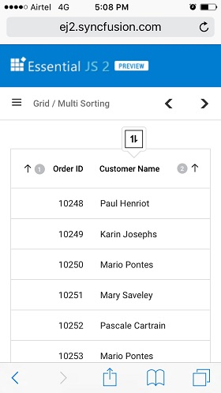

# Sorting

The Grid component has support to sort data bound columns in **ascending** or **descending** order.
This can be achieved by setting [`allowSorting`](../api/grid/#allowsorting) property as true.

To dynamically sort a particular column, click on its column header.
The order switch between **Ascending** and **Descending** each time you click a column header for sorting.

To use Sorting, you need to inject **SortService** in the provider section of **AppModule**.



```typescript
import { Component, OnInit } from '@angular/core';
import { data } from './datasource';

@Component({
    selector: 'app-root',
    template: `<ejs-grid [dataSource]='data' [allowSorting]='true' height='315px'>
                <e-columns>
                    <e-column field='OrderID' headerText='Order ID' textAlign='Right' width=120></e-column>
                    <e-column field='CustomerID' headerText='Customer ID' width=150></e-column>
                    <e-column field='ShipCity' headerText='Ship City' width=150></e-column>
                    <e-column field='ShipName' headerText='Ship Name' width=150></e-column>
                </e-columns>
                </ejs-grid>`
})
export class AppComponent implements OnInit {

    public data: object[];

    ngOnInit(): void {
        this.data = data;
    }
}

```



> * Grid column sorted in **Ascending** order. If you click on an already sorted column, then toggles the sort direction.
> * You can apply and clear sorting by invoking [`sortColumn`](../api/grid/#sortcolumn) and
[`clearSorting`](../api/grid/#clearsorting) methods.
> * To disable Sorting for a particular column,
by specifying [`columns.allowSorting`](../api/grid/column/#allowsorting) to false.

## Initial Sort

By default, the Grid records are not sorted at initial rendering.
To apply sort at initial rendering, set the [`field`](../api/grid/sortDescriptorModel/#field) and
[`direction`](../api/grid/sortDescriptorModel/#direction) in [`sortSettings.columns`](../api/grid/sortSettings/#columns).



```typescript
import { Component, OnInit } from '@angular/core';
import { data } from './datasource';

@Component({
    selector: 'app-root',
    template: `<ejs-grid [dataSource]='data' [allowSorting]='true' [sortSettings]='sortOptions' height='315px'>
                <e-columns>
                    <e-column field='OrderID' headerText='Order ID' textAlign='Right' width=120></e-column>
                    <e-column field='CustomerID' headerText='Customer ID' width=150></e-column>
                    <e-column field='ShipCity' headerText='Ship City' width=150></e-column>
                    <e-column field='ShipName' headerText='Ship Name' width=150></e-column>
                </e-columns>
                </ejs-grid>`
})
export class AppComponent implements OnInit {

    public data: object[];
    public sortOptions: object;

    ngOnInit(): void {
        this.data = data;
        this.sortOptions = { columns: [{ field: 'OrderID', direction: 'Ascending' }, { field: 'ShipCity', direction: 'Descending' }] };
    }
}

```



## Multi-column sorting

You can sort more than one column in a Grid. To sort multiple columns, press and hold the **CTRL** key and click the column header. The sorting order will be displayed in the header while performing multi-column sorting.

To clear sorting for a particular column, press the "Shift + mouse left click".

> The [`allowSorting`](../api/grid/#allowsorting) must be true while enabling multi-column sort.
> Set [`allowMultiSorting`](../api/grid/#allowmultisorting) property as **false** to disable multi-column sorting.



```typescript
import { Component, OnInit } from '@angular/core';
import { data } from './datasource';

@Component({
    selector: 'app-root',
    template: `<ejs-grid [dataSource]='data' [allowSorting]='true' [allowMultiSorting]='true' height='315px'>
                <e-columns>
                    <e-column field='OrderID' headerText='Order ID' textAlign='Right' width=120></e-column>
                    <e-column field='CustomerID' headerText='Customer ID' width=150></e-column>
                    <e-column field='ShipCity' headerText='Ship City' width=150></e-column>
                    <e-column field='ShipName' headerText='Ship Name' width=150></e-column>
                </e-columns>
                </ejs-grid>`
})
export class AppComponent implements OnInit {

    public data: object[];

    ngOnInit(): void {
        this.data = data;
    }
}
```



## Sort order

By default, the sorting order will be as **ascending -> descending -> none**.

When first click a column header it sorts the column in ascending. Again click the same column header, it will sort the column in descending. A repetitive third click on the same column header will clear the sorting.

## Sort foreign key column based on Text

For local data in Grid, sorting will be performed based on the [`foreignKeyValue`](../api/grid/column/#foreignkeyvalue).

For remote data in Grid, sorting will be performed based on the [`foreignKeyField`](../api/grid/column/#foreignkeyfield), we need to handle the sorting operation at the server side.

```typescript
import { Component, OnInit } from '@angular/core';
import { DataManager, ODataV4Adaptor } from '@syncfusion/ej2-data';
import { ForeignKeyService } from '@syncfusion/ej2-angular-grids';

@Component({
    selector: 'app-root',
    template: `<ejs-grid #grid [dataSource]='data' [height]='315'>
                    <e-columns>
                        <e-column field='OrderID' headerText='Order ID' textAlign='Right' width=100></e-column>
                        <e-column field='EmployeeID' headerText='Employee Name' width=120 foreignKeyValue='FirstName'
                         [dataSource]='employeeData'></e-column>
                        <e-column field='Freight' headerText='Freight' textAlign='Right' width=80></e-column>
                        <e-column field='ShipCity' headerText='Ship City' width=130  ></e-column>
                    </e-columns>
                </ejs-grid>`,
    providers: [ForeignKeyService]
})
export class AppComponent implements OnInit {

    public data: DataManager;
    public employeeData: DataManager;

    ngOnInit(): void {
        this.data = new DataManager({
            url: '/OData/Items',
            adaptor: new ODataV4Adaptor()
        });
        this.employeeData = new DataManager({
            url: '/OData/Brands',
            adaptor: new ODataV4Adaptor()
        });
    }
}

```

The following code example describes the handling of sorting operation at the server side.

```cs
    public class ItemsController : ODataController
    {
        [EnableQuery]
        public IQueryable<Item> Get()
        {
            List<Item> GridData = JsonConvert.DeserializeObject<Item[]>(Properties.Resources.ItemsJson).AsQueryable().ToList();
            List<Brand> empData = JsonConvert.DeserializeObject<Brand[]>(Properties.Resources.BrandsJson).AsQueryable().ToList();
            var queryString = HttpContext.Current.Request.QueryString;
            var allUrlKeyValues = ControllerContext.Request.GetQueryNameValuePairs();
            string key = allUrlKeyValues.LastOrDefault(x => x.Key == "$orderby").Value;
            if (key != null)
            {
                if (key == "EmployeeID") {
                    GridData = SortFor(key); //Only for foreignKey Column ascending
                }
                else if(key == "EmployeeID desc") {
                    GridData = SortFor(key); //Only for foreignKey Column descending
                }
            }
            var count = GridData.Count();
            var data = GridData.AsQueryable();
            return data;
        }

        public List<Item> SortFor(String Sorted)
        {
            List<Item> GridData = JsonConvert.DeserializeObject<Item[]>(Properties.Resources.ItemsJson).AsQueryable().ToList();
            List<Brand> empData = JsonConvert.DeserializeObject<Brand[]>(Properties.Resources.BrandsJson).AsQueryable().ToList();
            if (Sorted == "EmployeeID") //check whether ascending or descending
                empData = empData.OrderBy(e => e.FirstName).ToList();
            else if(Sorted == "EmployeeID desc")
                empData = empData.OrderByDescending(e => e.FirstName).ToList();
            List<Item> or = new List<Item>();
            for (int i = 0; i < empData.Count(); i++) {
                //Select the Field matching records
                IEnumerable<Item> list = GridData.Where(pred => pred.EmployeeID == empData[i].EmployeeID).ToList();
                or.AddRange(list);
            }
            return or;
        }
    }
```

## Sorting Events

During the sort action, the Grid component triggers two events.
[`actionBegin`](../api/grid/#actionbegin) event
triggers before the sort action start and
[`actionComplete`](../api/grid/#actioncomplete) event
triggers after the sort action complete. Using these events you can perform any actions.



```typescript
import { Component, OnInit } from '@angular/core';
import { data } from './datasource';
import { SortEventArgs } from '@syncfusion/ej2-angular-grids';

@Component({
    selector: 'app-root',
    template: `<ejs-grid [dataSource]='data' (actionComplete)='actionHandler($event)' (actionBegin)='actionHandler($event)'
               [allowSorting]='true' height='315px'>
                <e-columns>
                    <e-column field='OrderID' headerText='Order ID' textAlign='Right' width=120></e-column>
                    <e-column field='CustomerID' headerText='Customer ID' width=150></e-column>
                    <e-column field='ShipCity' headerText='Ship City' width=150></e-column>
                    <e-column field='ShipName' headerText='Ship Name' width=150></e-column>
                </e-columns>
                </ejs-grid>`
})
export class AppComponent implements OnInit {

    public data: object[];

    ngOnInit(): void {
        this.data = data;
    }

    actionHandler(args: SortEventArgs) {
        alert(args.requestType + ' ' + args.type); // custom Action
    }
}

```



> [`args.requestType`](../api/grid/sortEventArgs/#requesttype) is current action name.
For example in sorting, the [`args.requestType`](../api/grid/sortEventArgs/#requesttype) value is **sorting**.

## Sort Comparer

You can customize the default sort action for a column by defining [`column.sortComparer`](../api/grid/column/#sortcomparer) property.
The sort comparer function has the same functionality like
[`Array.sort`](https://developer.mozilla.org/en-US/docs/Web/JavaScript/Reference/Global_Objects/Array/sort) sort comparer.

In the following example, custom sort comparer function was defined in **Customer ID** column.



```typescript
import { Component, OnInit } from '@angular/core';
import { data } from './datasource';

@Component({
    selector: 'app-root',
    template: `<ejs-grid [dataSource]='data' [allowSorting]='true' height='315px'>
                <e-columns>
                    <e-column field='OrderID' headerText='Order ID' textAlign='Right' width=120></e-column>
                    <e-column field='CustomerID' [sortComparer]='sortComparer' headerText='Customer ID' width=150></e-column>
                    <e-column field='Freight' headerText='Freight' width=100 format='C2'></e-column>
                    <e-column field='ShipName' headerText='Ship Name' width=150></e-column>
                </e-columns>
                </ejs-grid>`
})
export class AppComponent implements OnInit {

    public data: object[];
    // The custom function
    public sortComparer = (reference: string, comparer: string) => {
        if (reference < comparer) {
            return -1;
        }
        if (reference > comparer) {
            return 1;
        }
        return 0;
    }

    ngOnInit(): void {
        this.data = data;
    }
}

```



## Touch Interaction

When you tap Grid header on touchscreen devices, then the selected column header is sorted.
Also, it will show a popup   for multi-column sorting.
To sort multiple columns, tap the popup and then tap the desired Grid headers.

> The [`allowMultiSorting`](../api/grid/#allowmultisorting) and [`allowSorting`](../api/grid/#allowsorting) should be **true** then only the popup will be shown.

The following screenshot represents a Grid touch sorting in the device.



## See Also

* [How to remove the Sorting indicator from the column headers in Angular Grid](https://www.syncfusion.com/forums/150597/how-to-remove-the-sorting-indicator-from-the-column-headers-in-angular-grid)