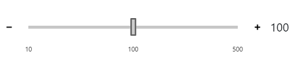

# Customize Slider as MS word Zoom

Slider view can be customized via CSS. By overriding the slider CSS classes, you can customize the slider buttons and thumbs. The ticks in slider allows you to easily identify the value in the slider.

Here we are going to achieve the Slider as like the below screenshot.



By default, slider has even split values in ticks. And we can achive slider ticks value as like above image. To achieve this we can use  [customValues](../../api/slider/#customvalues) to render the Ticks. Refer to the below code snippet to display needed ticks in slider.

```typescript

public renderedTicks(event) {
    event.tickElements.forEach((element) => {
      if (element.title !== '10' && element.title !== '100' && element.title !== '500') {
        element.classList.add('e-display-none');
      }
    })
  }
}

```

To customize the Slider handle, refer to the below code snippet.

```css
#slider.e-control.e-slider .e-handle {
    height: 25px;
    width: 8px;
    top: 3px;
    margin-left: -4px;
    border-radius: 1px;
    background-color:#ccc;
}

```

To customize the Slider Button, refer to the below code snippet.

```css

.e-control-wrapper.e-slider-container .e-slider-button{
    border: 0px;
}
  
.e-control-wrapper.e-slider-container.e-horizontal .e-second-button .e-button-icon {
    background-image: url('data:image/png;base64,iVBORw0KGgoAAAANSUhEUgAAADAAAAAwCAYAAABXAvmHAAAAAXNSR0IArs4c6QAAAARnQU1BAACxjwv8YQUAAAAJcEhZcwAADsMAAA7DAcdvqGQAAADKSURBVGhD7dqxDYMwEIXhc9aicec1KFiAziN4C7MJjOCWaUicXFwihJGeTnqfhMAFxQ+ywAh3fIhhL92b9VjAtm3inLu0LcuiZ/XjHUBjABoD0BiAxgA0BqAxAM18QFuR1ff5HqUUmedZR+dijBJC0NE93vvvvgXUhYYl/5Uw5wAaA9AYgMYANPMB7Unc+7lv33dJKeno3DRNMgyDju4Zx/F3UAOesK5rvRCXtpyzntWPcwCNAWgMQGMAGgPQGIDGADTzAfxbBUvkDXe7zQJva1o6AAAAAElFTkSuQmCC');
  }
  
.e-control-wrapper.e-slider-container.e-horizontal .e-first-button .e-button-icon {
    background-image: url('data:image/png;base64,iVBORw0KGgoAAAANSUhEUgAAADAAAAAwCAYAAABXAvmHAAAAAXNSR0IArs4c6QAAAARnQU1BAACxjwv8YQUAAAAJcEhZcwAADsMAAA7DAcdvqGQAAAB1SURBVGhD7dfBCcAgEAVRk2aszmqszmpMWIItDD/MuyzsbQ4Leu1XC3Z/M5YBNANoBtAMoBlAM4BmAM0A2vmRzTlrkWKMUfME9N5rkWKtVdMboBlAM4BmAC0+4D9PiVTeAM0AmgE0A2gG0AygGUAzgBYe0NoDs18dSCJjSCYAAAAASUVORK5CYII=');
  }

```



```typescript

import { Component } from '@angular/core';

@Component({
  selector: 'my-app',
  template: `
    <div class="container">
        <div id="text">
            <label for="slider">Slider</label>
            <br/> <br/> <br/>
            <div class="middle">
                <div class="first">
                    <ejs-slider id='slider' width="300" [customValues]='customvalues'  [showButtons]=true [(ngModel)]="slidervalue" name="slider" required #slider="ngModel" [ticks]='ticks' (change)="change($event)" (renderedTicks)='renderedTicks($event)'>
                    </ejs-slider>
                </div>
                <div class="second">
                    <span for="slider">{{value}}</span>
                </div>
            </div>
        </div>
    </div>`,
    styleUrls : ["app/app.component.css"]
})

export class AppComponent {
   public slidervalue = 3;
   public customvalues = [10, 20, 30, 100, 250, 400, 500];

   public ticks = {
    placement: 'After',
  };

  public value = this.customvalues[this.slidervalue];

  public change(args) {
    this.value = this.customvalues[args.value];
  }

  public renderedTicks(event) {
    event.tickElements.forEach((element) => {
      if (element.title !== '10' && element.title !== '100' && element.title !== '500') {
        element.classList.add('e-display-none');
      }
    })
  }
}


