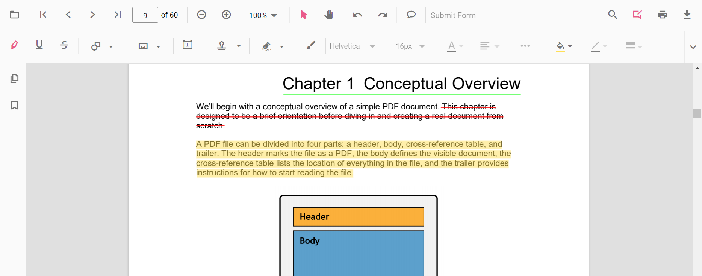
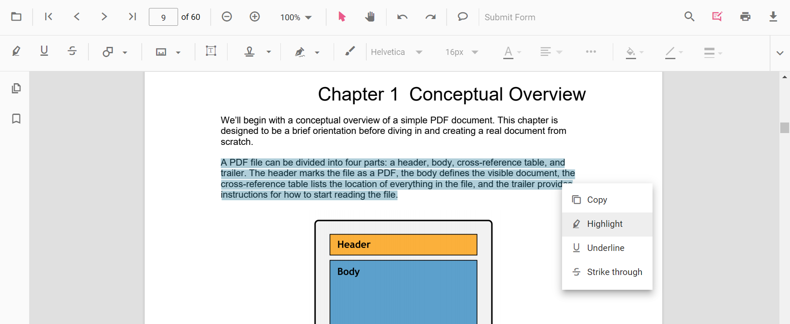
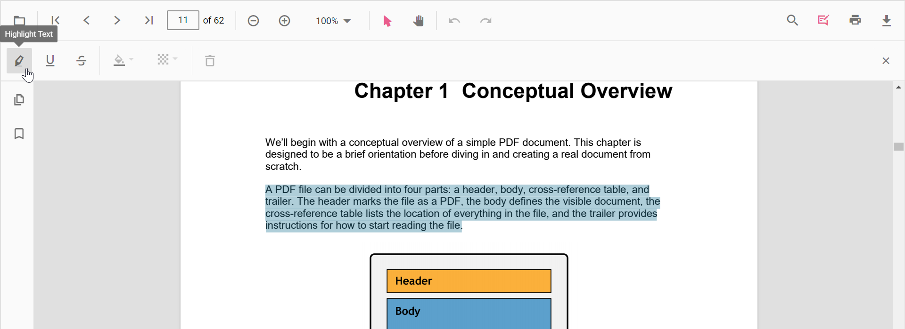
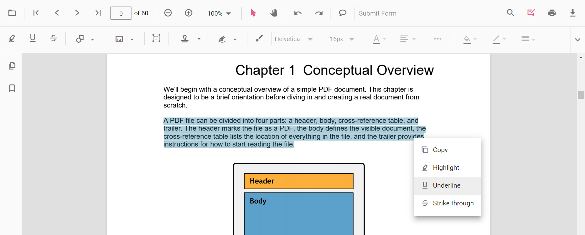
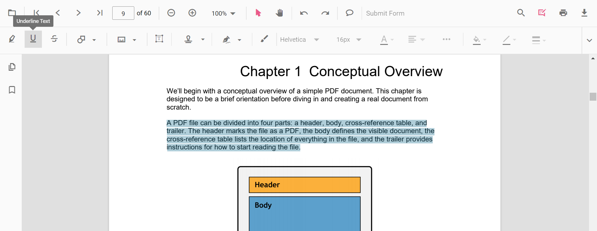
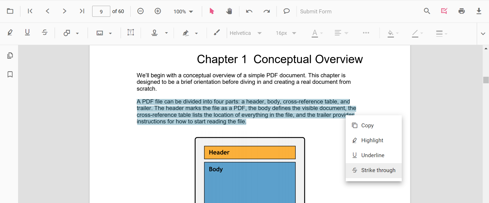
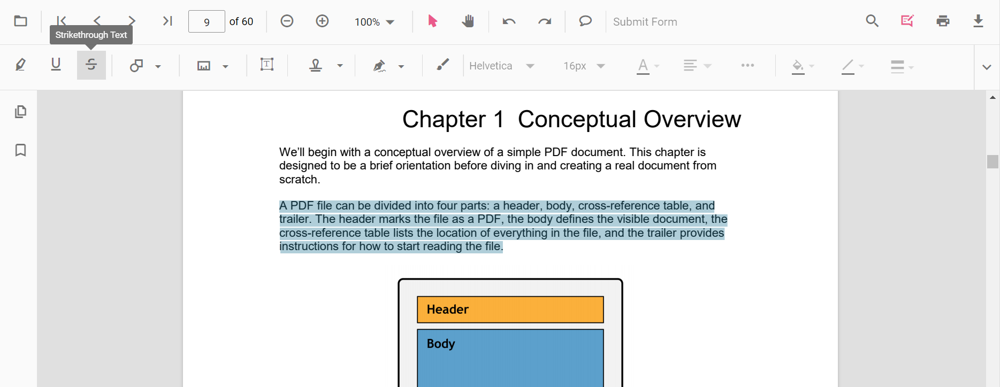
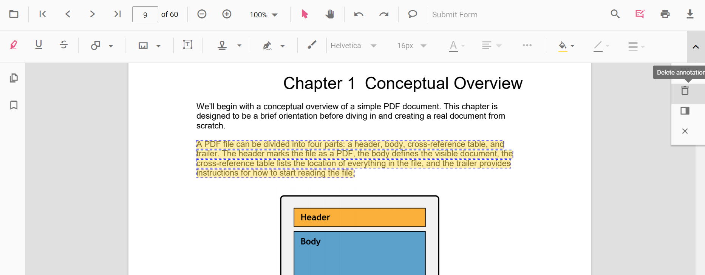
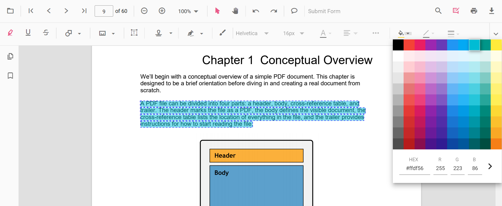
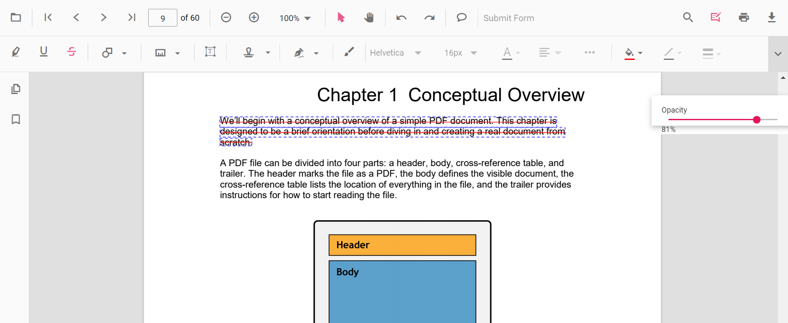

# Text Markup Annotation in the Angular PDF Viewer component

The PDF Viewer control provides the options to add, edit, and delete text markup annotations such as highlight, underline, and strikethrough annotations in the PDF document.



## Highlight a text

There are two ways to highlight a text in the PDF document:

1. Using the context menu
    * Select a text in the PDF document and right-click it.
    * Select **Highlight** option in the context menu that appears.



<!-- markdownlint-disable MD029 -->
2. Using the annotation toolbar
    * Click the **Edit Annotation** button in the PDF Viewer toolbar. A toolbar appears below it.
    * Select the **Highlight** button in the annotation toolbar. It enables the highlight mode.
    * Select the text and the highlight annotation will be added.
    * You can also select the text and apply the highlight annotation using the **Highlight** button.



In the pan mode, if the highlight mode is entered, the PDF Viewer control will switch to text select mode to enable the text selection for highlighting the text.

Refer to the following code sample to switch to the highlight mode.

```typescript
import { ViewChild } from '@angular/core';
import { Component, OnInit } from '@angular/core';
import {
  PdfViewerComponent, LinkAnnotationService, BookmarkViewService, MagnificationService, ThumbnailViewService,
  ToolbarService, NavigationService, TextSearchService, TextSelectionService, PrintService, AnnotationService
} from '@syncfusion/ej2-angular-pdfviewer';

@Component({
  selector: 'app-root',
  // Specifies the template string for the PDF Viewer component.
  template: `<button (click)="addAnnot()">Highlight</button>
  <div class="content-wrapper">
  <ejs-pdfviewer id="pdfViewer" [serviceUrl]='service' [documentPath]='document' style="height:640px;display:block"></ejs-pdfviewer>
  </div>`,
  providers: [LinkAnnotationService, BookmarkViewService, MagnificationService, ThumbnailViewService, ToolbarService,
NavigationService, TextSearchService, TextSelectionService, PrintService, AnnotationService]
})
export class AppComponent implements OnInit {
  @ViewChild('pdfviewer')
  public pdfviewerControl: PdfViewerComponent;
  public service: string = 'https://ej2services.syncfusion.com/production/web-services/api/pdfviewer';
  public document: string = 'PDF_Succinctly.pdf';
  addAnnot() {
    var pdfviewer = (<any>document.getElementById("pdfViewer"))
      .ej2_instances[0];
    pdfviewer.annotationModule.setAnnotationMode("Highlight");
  }
  ngOnInit(): void {
  }
}
```

Refer to the following code sample to switch back to normal mode from the highlight mode.

```typescript
import { ViewChild } from '@angular/core';
import { Component, OnInit } from '@angular/core';
import {
  PdfViewerComponent, LinkAnnotationService, BookmarkViewService, MagnificationService, ThumbnailViewService,
  ToolbarService, NavigationService, TextSearchService, TextSelectionService, PrintService, AnnotationService
} from '@syncfusion/ej2-angular-pdfviewer';

@Component({
  selector: 'app-root',
  // Specifies the template string for the PDF Viewer component.
  template: `<button (click)="addAnnot()">Highlight</button><button (click)="setNone()">None</button>
  <div class="content-wrapper">
  <ejs-pdfviewer id="pdfViewer" [serviceUrl]='service' [documentPath]='document' style="height:640px;display:block"></ejs-pdfviewer>
  </div>`,
  providers: [LinkAnnotationService, BookmarkViewService, MagnificationService, ThumbnailViewService, ToolbarService,
NavigationService, TextSearchService, TextSelectionService, PrintService, AnnotationService]
})
export class AppComponent implements OnInit {
  @ViewChild('pdfviewer')
  public pdfviewerControl: PdfViewerComponent;
  public service: string = 'https://ej2services.syncfusion.com/production/web-services/api/pdfviewer';
  public document: string = 'PDF_Succinctly.pdf';
  addAnnot() {
    var pdfviewer = (<any>document.getElementById("pdfViewer"))
      .ej2_instances[0];
    pdfviewer.annotationModule.setAnnotationMode("Highlight");
  }
  setNone() {
    var pdfviewer = (<any>document.getElementById("pdfViewer"))
      .ej2_instances[0];
    pdfviewer.annotationModule.setAnnotationMode("None");
  }
  ngOnInit(): void {
  }
}
```

## Underline a text

There are two ways to underline a text in the PDF document:

1. Using the context menu
    * Select a text in the PDF document and right-click it.
    * Select the **Underline** option in the context menu that appears.



<!-- markdownlint-disable MD029 -->
2. Using the annotation toolbar
    * Click the **Edit Annotation** button in the PDF Viewer toolbar. A toolbar appears below it.
    * Select the **Underline** button in the annotation toolbar. It enables the underline mode.
    * Select the text and the underline annotation will be added.
    * You can also select the text and apply the underline annotation using the **Underline** button.



In the pan mode, if the underline mode is entered, the PDF Viewer control will switch to text select mode to enable the text selection for underlining the text.

Refer to the following code sample to switch to the underline mode.

```typescript
import { ViewChild } from '@angular/core';
import { Component, OnInit } from '@angular/core';
import {
  PdfViewerComponent, LinkAnnotationService, BookmarkViewService, MagnificationService, ThumbnailViewService,
  ToolbarService, NavigationService, TextSearchService, TextSelectionService, PrintService, AnnotationService
} from '@syncfusion/ej2-angular-pdfviewer';

@Component({
  selector: 'app-root',
  // Specifies the template string for the PDF Viewer component.
  template: `<button (click)="addAnnot()">Underline</button>
  <div class="content-wrapper">
  <ejs-pdfviewer id="pdfViewer" [serviceUrl]='service' [documentPath]='document' style="height:640px;display:block"></ejs-pdfviewer>
  </div>`,
  providers: [LinkAnnotationService, BookmarkViewService, MagnificationService, ThumbnailViewService, ToolbarService,
NavigationService, TextSearchService, TextSelectionService, PrintService, AnnotationService]
})
export class AppComponent implements OnInit {
  @ViewChild('pdfviewer')
  public pdfviewerControl: PdfViewerComponent;
  public service: string = 'https://ej2services.syncfusion.com/production/web-services/api/pdfviewer';
  public document: string = 'PDF_Succinctly.pdf';
  addAnnot() {
    var pdfviewer = (<any>document.getElementById("pdfViewer"))
      .ej2_instances[0];
    pdfviewer.annotationModule.setAnnotationMode("Underline");
  }
  ngOnInit(): void {
  }
}
```

Refer to the following code sample to switch back to normal mode from the underline mode.

```typescript
import { ViewChild } from '@angular/core';
import { Component, OnInit } from '@angular/core';
import {
  PdfViewerComponent, LinkAnnotationService, BookmarkViewService, MagnificationService, ThumbnailViewService,
  ToolbarService, NavigationService, TextSearchService, TextSelectionService, PrintService, AnnotationService
} from '@syncfusion/ej2-angular-pdfviewer';

@Component({
  selector: 'app-root',
  // Specifies the template string for the PDF Viewer component.
  template: `<button (click)="addAnnot()">Underline</button><button (click)="setNone()">None</button>
  <div class="content-wrapper">
  <ejs-pdfviewer id="pdfViewer" [serviceUrl]='service' [documentPath]='document' style="height:640px;display:block"></ejs-pdfviewer>
  </div>`,
  providers: [LinkAnnotationService, BookmarkViewService, MagnificationService, ThumbnailViewService, ToolbarService,
NavigationService, TextSearchService, TextSelectionService, PrintService, AnnotationService]
})
export class AppComponent implements OnInit {
  @ViewChild('pdfviewer')
  public pdfviewerControl: PdfViewerComponent;
  public service: string = 'https://ej2services.syncfusion.com/production/web-services/api/pdfviewer';
  public document: string = 'PDF_Succinctly.pdf';
  addAnnot() {
    var pdfviewer = (<any>document.getElementById("pdfViewer"))
      .ej2_instances[0];
    pdfviewer.annotationModule.setAnnotationMode("Underline");
  }
  setNone() {
    var pdfviewer = (<any>document.getElementById("pdfViewer"))
      .ej2_instances[0];
    pdfviewer.annotationModule.setAnnotationMode("None");
  }
  ngOnInit(): void {
  }
}
```

## Strikethrough a text

There are two ways to strikethrough a text in the PDF document:

1. Using the context menu
    * Select a text in the PDF document and right-click it.
    * Select the **Strikethrough** option in the context menu that appears.



<!-- markdownlint-disable MD029 -->
2. Using the annotation toolbar
    * Click the **Edit Annotation** button in the PDF Viewer toolbar. A toolbar appears below it.
    * Select the **Strikethrough** button in the annotation toolbar. It enables the strikethrough mode.
    * Select the text and the strikethrough annotation will be added.
    * You can also select the text and apply the strikethrough annotation using the **Strikethrough** button.



In the pan mode, if the strikethrough mode is entered, the PDF Viewer control will switch to text select mode to enable the text selection for striking through the text.

Refer to the following code sample to switch to strikethrough mode.

```typescript
import { ViewChild } from '@angular/core';
import { Component, OnInit } from '@angular/core';
import {
  PdfViewerComponent, LinkAnnotationService, BookmarkViewService, MagnificationService, ThumbnailViewService,
  ToolbarService, NavigationService, TextSearchService, TextSelectionService, PrintService, AnnotationService
} from '@syncfusion/ej2-angular-pdfviewer';

@Component({
  selector: 'app-root',
  // Specifies the template string for the PDF Viewer component.
  template: `<button (click)="addAnnot()">Strikethrough</button>
  <div class="content-wrapper">
  <ejs-pdfviewer id="pdfViewer" [serviceUrl]='service' [documentPath]='document' style="height:640px;display:block"></ejs-pdfviewer>
  </div>`,
  providers: [LinkAnnotationService, BookmarkViewService, MagnificationService, ThumbnailViewService, ToolbarService,
NavigationService, TextSearchService, TextSelectionService, PrintService, AnnotationService]
})
export class AppComponent implements OnInit {
  @ViewChild('pdfviewer')
  public pdfviewerControl: PdfViewerComponent;
  public service: string = 'https://ej2services.syncfusion.com/production/web-services/api/pdfviewer';
  public document: string = 'PDF_Succinctly.pdf';
  addAnnot() {
    var pdfviewer = (<any>document.getElementById("pdfViewer"))
      .ej2_instances[0];
    pdfviewer.annotationModule.setAnnotationMode("Strikethrough");
  }
  ngOnInit(): void {
  }
}
```

Refer to the following code sample to switch back to normal mode from the strikethrough mode.

```typescript
import { ViewChild } from '@angular/core';
import { Component, OnInit } from '@angular/core';
import {
  PdfViewerComponent, LinkAnnotationService, BookmarkViewService, MagnificationService, ThumbnailViewService,
  ToolbarService, NavigationService, TextSearchService, TextSelectionService, PrintService, AnnotationService
} from '@syncfusion/ej2-angular-pdfviewer';

@Component({
  selector: 'app-root',
  // Specifies the template string for the PDF Viewer component.
  template: `<button (click)="addAnnot()">Strikethrough</button><button (click)="setNone()">None</button>
  <div class="content-wrapper"><ejs-pdfviewer id="pdfViewer" [serviceUrl]='service' [documentPath]='document' style="height:640px;display:block"></ejs-pdfviewer>
  </div>`,
  providers: [LinkAnnotationService, BookmarkViewService, MagnificationService, ThumbnailViewService, ToolbarService,
NavigationService, TextSearchService, TextSelectionService, PrintService, AnnotationService]
})
export class AppComponent implements OnInit {
  @ViewChild('pdfviewer')
  public pdfviewerControl: PdfViewerComponent;
  public service: string = 'https://ej2services.syncfusion.com/production/web-services/api/pdfviewer';
  public document: string = 'PDF_Succinctly.pdf';
  addAnnot() {
    var pdfviewer = (<any>document.getElementById("pdfViewer"))
      .ej2_instances[0];
    pdfviewer.annotationModule.setAnnotationMode("Strikethrough");
  }
  setNone() {
    var pdfviewer = (<any>document.getElementById("pdfViewer"))
      .ej2_instances[0];
    pdfviewer.annotationModule.setAnnotationMode("None");
  }
  ngOnInit(): void {
  }
}
```

## Deleting a text markup annotation

The selected annotation can be deleted in the following ways:

1. Using the Delete key
    * Select the annotation to be deleted.
    * Click the Delete key in the keyboard. The selected annotation will be deleted.

2. Using the annotation toolbar
    * Select the annotation to be deleted.
    * Click the **Delete Annotation** button in the annotation toolbar. The selected annotation will be deleted.



## Editing the properties of the text markup annotation

The color and the opacity of the text markup annotation can be edited using the Edit Color tool and the Edit Opacity tool in the annotation toolbar.

### Editing color

The color of the annotation can be edited using the color palette provided in the Edit Color tool.



### Editing opacity

The opacity of the annotation can be edited using the range slider provided in the Edit Opacity tool.



## Setting default properties during the control initialization

The properties of the text markup annotation can be set before creating the control using the  highlightSettings, underlineSettings, and strikethroughSettings.

>After editing the default color and opacity using the Edit Color tool and Edit Opacity tool, they will be changed to the selected values.

Refer to the following code sample to set the default annotation settings.

```typescript
import { ViewChild } from '@angular/core';
import { Component, OnInit } from '@angular/core';
import {
  PdfViewerComponent, LinkAnnotationService, BookmarkViewService, MagnificationService, ThumbnailViewService,
  ToolbarService, NavigationService, TextSearchService, TextSelectionService, PrintService, AnnotationService
} from '@syncfusion/ej2-angular-pdfviewer';

@Component({
  selector: 'app-root',
  // Specifies the template string for the PDF Viewer component.
  template: `<div class="content-wrapper">
  <ejs-pdfviewer id="pdfViewer" [serviceUrl]='service' [documentPath]='document' [highlightSettings]='highlightSettings' [underlineSettings]='underlineSettings' [strikethroughSettings] = 'strikethroughSettings' style="height:640px;display:block"></ejs-pdfviewer>
  </div>`,
  providers: [LinkAnnotationService, BookmarkViewService, MagnificationService, ThumbnailViewService, ToolbarService,
NavigationService, TextSearchService, TextSelectionService, PrintService, AnnotationService]
})
export class AppComponent implements OnInit {
  @ViewChild('pdfviewer')
  public pdfviewerControl: PdfViewerComponent;
  public service: string = 'https://ej2services.syncfusion.com/production/web-services/api/pdfviewer';
  public document: string = 'PDF_Succinctly.pdf';
  public highlightSettings = {author: 'Guest User', subject: 'Important', color: '#ffff00', opacity: 0.9, modifiedDate: ''};
  public underlineSettings = {author: 'Guest User', subject: 'Points to be remembered', color: '#00ffff', opacity: 0.9, modifiedDate: ''};
  public strikethroughSettings = {author: 'Guest User', subject: 'Not Important', color: '#ff00ff', opacity: 0.9, modifiedDate: ''};
  ngOnInit(): void {
  }
}
```

## Performing undo and redo

The PDF Viewer performs undo and redo for the changes made in the PDF document. In the text markup annotation, undo and redo actions are provided for:

* Inclusion of the text markup annotations.
* Deletion of the text markup annotations.
* Change of either color or opacity of the text markup annotations.

The undo and redo actions can be done in the following ways:

1. Using the keyboard shortcuts:
    After performing a text markup annotation action, you can undo it by using the Ctrl + Z shortcut and redo by using the Ctrl + Y shortcut.
2. Using toolbar:
    The Undo and redo can be done using the **Undo** tool and **Redo** tool provided in the toolbar.

Refer to the following code sample for calling undo and redo actions from the client-side.

```typescript
import { ViewChild } from '@angular/core';
import { Component, OnInit } from '@angular/core';
import {
  PdfViewerComponent, LinkAnnotationService, BookmarkViewService, MagnificationService, ThumbnailViewService,
  ToolbarService, NavigationService, TextSearchService, TextSelectionService, PrintService, AnnotationService
} from '@syncfusion/ej2-angular-pdfviewer';

@Component({
  selector: 'app-root',
  // Specifies the template string for the PDF Viewer component.
  template: `<button (click)="Undo()">Undo</button><button (click)="Redo()">Redo</button>
  <div class="content-wrapper"><ejs-pdfviewer id="pdfViewer" [serviceUrl]='service' [documentPath]='document' style="height:640px;display:block"></ejs-pdfviewer>
  </div>`,
  providers: [LinkAnnotationService, BookmarkViewService, MagnificationService, ThumbnailViewService, ToolbarService,
NavigationService, TextSearchService, TextSelectionService, PrintService, AnnotationService]
})
export class AppComponent implements OnInit {
  @ViewChild('pdfviewer')
  public pdfviewerControl: PdfViewerComponent;
  public service: string = 'https://ej2services.syncfusion.com/production/web-services/api/pdfviewer';
  public document: string = 'PDF_Succinctly.pdf';
  Undo() {
    var pdfviewer = (<any>document.getElementById("pdfViewer"))
      .ej2_instances[0];
    pdfviewer.undo();
  }
  Redo() {
    var pdfviewer = (<any>document.getElementById("pdfViewer"))
      .ej2_instances[0];
    pdfviewer.redo();
  }
  ngOnInit(): void {
  }
}
```

## Saving the text markup annotation

When you click the download tool in the toolbar, the text markup annotations will be saved in the PDF document. This action will not affect the original document.

## Printing the text markup annotation

When the print tool is selected in the toolbar, the PDF document will be printed along with the text markup annotations added to the pages. This action will not affect the original document.

## Disabling text markup annotation

The PDF Viewer control provides an option to disable the text markup annotation feature. The code sample for disabling the feature is as follows.

```typescript
import { ViewChild } from '@angular/core';
import { Component, OnInit } from '@angular/core';
import {
  PdfViewerComponent, LinkAnnotationService, BookmarkViewService, MagnificationService, ThumbnailViewService,
  ToolbarService, NavigationService, TextSearchService, TextSelectionService, PrintService, AnnotationService
} from '@syncfusion/ej2-angular-pdfviewer';

@Component({
  selector: 'app-root',
  // Specifies the template string for the PDF Viewer component.
  template: `<div class="content-wrapper">
  <ejs-pdfviewer id="pdfViewer" [serviceUrl]='service' [documentPath]='document' [enableTextMarkupAnnotation]='false' style="height:640px;display:block"></ejs-pdfviewer>
  </div>`,
  providers: [LinkAnnotationService, BookmarkViewService, MagnificationService, ThumbnailViewService, ToolbarService,
NavigationService, TextSearchService, TextSelectionService, PrintService, AnnotationService]
})
export class AppComponent implements OnInit {
  @ViewChild('pdfviewer')
  public pdfviewerControl: PdfViewerComponent;
  public service: string = 'https://ej2services.syncfusion.com/production/web-services/api/pdfviewer';
  public document: string = 'PDF_Succinctly.pdf';  
  ngOnInit(): void {
  }
}
```