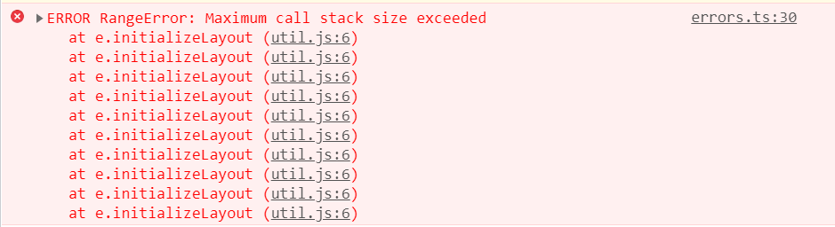
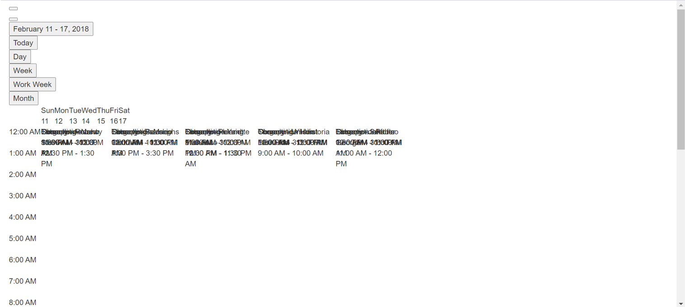
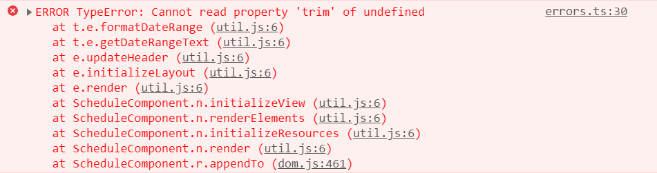

# Frequently asked questions

In this article, you can find some frequently asked questions and corresponding solutions while getting hands-on experience with scheduler control.

## Maximum call stack size exceeded

**Error Image:**



**Solution:**

The above error occurs when using scheduler views that were not imported into the project. You can resolve this issue by importing the required view modules.

In the below code, `Day` option is used without injecting, So, it throws the above error. You can resolve this problem by simply injecting the day module in below code.

```typescript
import { Component } from '@angular/core';
import { AgendaService, TimelineViewsService, TimelineMonthService, EventSettingsModel } from '@syncfusion/ej2-angular-schedule';

@Component({
    selector: "app-root",
    providers: [ AgendaService, TimelineViewsService, TimelineMonthService],
    // specifies the template string for the Schedule component
    template: `
    <ejs-schedule width="100%" height="550px" [selectedDate]="selectedDate" [views]="views"
      [eventSettings]="eventSettings">
      <e-resources>
        <e-resource field="OwnerId" title="Owner" name="Owners"
          [dataSource]="ownerDataSource" [allowMultiple]="allowMultipleOwner"
          textField="OwnerText" idField="Id" colorField="OwnerColor">
        </e-resource>
      </e-resources>
    </ejs-schedule>`
})
export class AppComponent {
    public selectedDate: Date = new Date(2021, 7, 1);
    // Day view service not imported but still used
    public views: Array<string> = ['Day', 'TimelineWeek', 'TimelineMonth', 'Agenda'];
    public eventSettings: EventSettingsModel = {
        dataSource: resourceData
    };
    public allowMultipleOwner: Boolean = true;
    public ownerDataSource: Object[] = [
        { OwnerText: 'Nancy', Id: 1, OwnerColor: '#ffaa00' },
        { OwnerText: 'Steven', Id: 2, OwnerColor: '#f8a398' },
        { OwnerText: 'Michael', Id: 3, OwnerColor: '#7499e1' }
    ];
}
```

> If `ScheduleAllModule` was injected from module files, the above issue is not thrown.

## Grouping with empty resources

Grouping without providing any resource data will throw the following problems.

* Normal(vertical) views are rendered, but you are not able to perform CRUD operations
* Timeline views not at all render and shows empty scheduler table

So, we suggest to avoid grouping with empty resources in the scheduler.

## Not providing e-field in editor template

**Error:** While using editor template, value of  `e-field` is missing in editor window.

**Solution:** `e-field` value is mandatory, we need to add it. Please refer [here](https://ej2.syncfusion.com/angular/documentation/schedule/editor-template/#customizing-event-editor-using-template) for more info.

## Missing CSS reference

**Error Image:**

  

**Solution:**

The above problem occurs when missing CSS references for the scheduler in a project. You can resolve this issue by providing proper CSS for the scheduler.

```html
<!doctype html>
 <html lang="en">
 <head>
  <meta charset="utf-8">
  <title>EJ2 Angular Schedule Sample</title>
  
      <! –– scheduler CSS is referred from this link ––>
  <link href="https://cdn.syncfusion.com/ej2/material.css" rel="stylesheet">
  <meta name="viewport" content="width=device-width, initial-scale=1">
  <link rel="icon" type="image/x-icon" href="favicon.ico">
 </head>
<body>
  <app-root></app-root>
</body>
</html>
```

## QuickInfoTemplate at bottom

When using the `quickInfoTemplate` in scheduler, sometimes quickinfo popup not shown fully at the bottom area of scheduler. You can resolve this by using `cellClick` and `eventClick` events and below code snippet.

```typescript

 template: "<ejs-schedule #schedule height="650px" (cellClick)="onClick($event)" (eventClick)="onClick($event)"></ejs-schedule>"
  .
  .
  .
  public eventAdded: boolean = false;

  onClick(args: EventClickArgs): void {
    if (!this.eventAdded) {
      let popupInstance = (document.querySelector(".e-quick-popup-wrapper") as any).ej2_instances[0];
      popupInstance.open = () => {
        popupInstance.refreshPosition();
      };
      this.eventAdded = true;
    }
  }
```

## Not importing culture files while using localization

**Error Image:**



 While using [`locale`](https://ej2.syncfusion.com/angular/documentation/schedule/localization/) in scheduler, not importing the required culture files properly throws the problem.

**Solution:** Properly add and import the culture files(numberingSystems, timeZoneNames, loadCldr, L10n etc.,) in your project will resolve the problem.

```typescript
import { loadCldr, L10n } from '@syncfusion/ej2-base';
import * as numberingSystems from './culture-files/numberingSystems.json';
import * as gregorian from './culture-files/ca-gregorian.json';
import * as numbers from './culture-files/numbers.json';
import * as timeZoneNames from './culture-files/timeZoneNames.json';

loadCldr(numberingSystems, gregorian, numbers, timeZoneNames);

L10n.load({
  'en-GB': {
    schedule: {
      day: 'Day',
      week: 'Week',
      workWeek: 'Work Week',
      month: 'Month'
      }
    }
  });

```